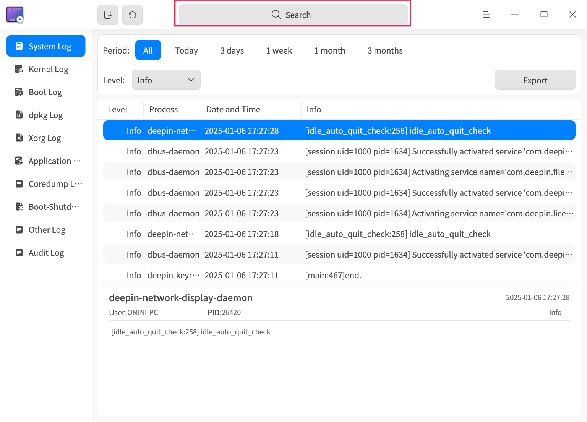
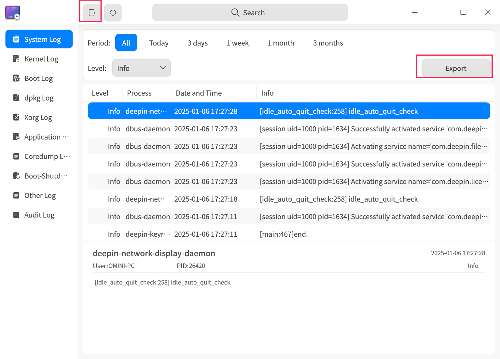
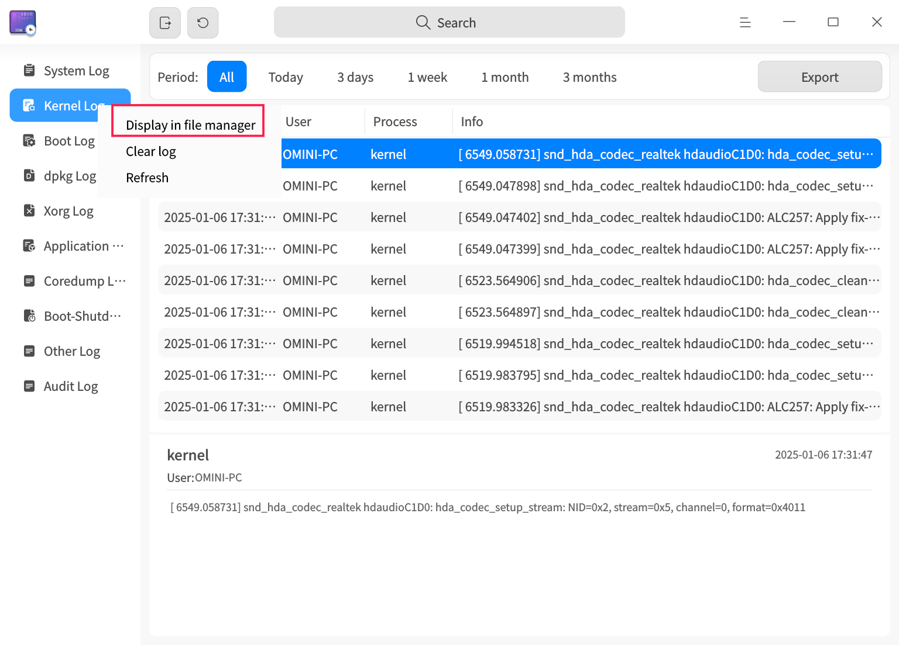

# Log Viewer|deepin-log-viewer|

## Overview

The log collection tool is a small utility responsible for collecting logs generated during program execution, such as relevant information about the operating system and applications during startup, operation, etc. By analyzing detailed log information, you can quickly find the cause of failures and resolve issues.

## Getting Started

You can run, close the log collection tool, or create shortcuts in the following ways.

### Running the Log Collection Tool

1. Click the launcher icon on the taskbar  to enter the launcher interface.

2. Scroll up or down with the mouse wheel or search to find the log collection tool icon , and click to run it.

3. Right-click on the icon, and you can:

   - Click **Send to Desktop** to create a shortcut on the desktop.
    - Click **Send to Taskbar** to pin the application to the taskbar.
    - Click **Start Automatically** to add the application to the startup items, so it runs automatically when the computer starts.

### Closing the Log Collection Tool

- In the log collection tool interface, click  to exit the log collection tool.
- Right-click on the taskbar , and select **Close All** to exit the log collection tool.
- In the log collection tool interface, click  and select **Exit** to close the tool.

## Operations Introduction

>  The log collection tool supports the display of various log types. Due to differences in system versions or architectures, the available log types may vary. Please refer to the final page for the specific features.
>
>  Depending on the log type, the available filtering options, whether the log can be displayed in the file manager, and whether log clearing is supported may differ. Please refer to the final page for specific functionalities.
>
> The following section will introduce the operation of the log collection tool with **system logs** and **kernel logs** as examples.

### Search Logs

1. In the log collection tool search box, click .
2. Enter keywords to display search results in real-time.
3. Click  to clear the search content.



### Filter Logs

1. In the log collection tool’s top filter bar, select the option you want to filter by.
2. After clicking or selecting a filter, the log collection tool will immediately display the filtered results.


### View Logs

1. In the log collection tool interface, click on the log type menu you wish to view, and the right-side list will display all logs of that type.
2. Left-click on a log, and you can view the detailed information of the log in the lower section of the tool.


### Custom Logs

The custom log feature allows you to add log files to the log collection tool for viewing and exporting. Custom logs are compatible with both Gsettings and Dconfig configurations.

**Gsettings Configuration**

1. Execute the Gsettings configuration command in the terminal. Replace the “[]” with the log file paths, for example: ['a.log', 'b.log', 'c.log'].

```shell
gsettings set com.deepin.log.viewer customlogfiles []
```

1. In the log collection tool interface, click **Custom Logs**, and you will see the existing configuration.

**Dconfig Configuration**

1. Execute the Dconfig configuration command in the terminal. Replace the “[]” with the log file paths, for example: ["a.log", "b.log", "c.log"].

```shell
dde-dconfig --set -a org.deepin.log.viewer -r org.deepin.log.viewer -k customLogFiles -v '["a.log","b.log","c.log"]'
```

1. In the log collection tool interface, click **Custom Logs**, and you will see the existing configuration.

### Export Logs

The export log function allows you to export the log query results to the local system, helping you analyze, locate, and resolve issues.

1. Select a log type and click the **Export** button in the upper-right corner of the interface.
2. If a password authentication window pops up, enter your user login password and click **OK**.
3. In the pop-up window, select the storage location and click **Save**.

>  Note: You can also click the **Export All** button in the title bar  to export all logs.



### Refresh Logs

Logs can be refreshed manually or automatically. The frequency of automatic refresh can be customized.

#### Manual Log Refresh

Click the **Refresh** button in the title bar ; or right-click on a log type and select **Refresh** to refresh the logs.


#### Automatic Log Refresh

1. In the log collection tool interface, click  > **Refresh Frequency**.
2. Select the automatic refresh frequency: **Every 10 seconds**, **Every 1 minute**, or **Every 5 minutes** to refresh the logs. Select **Do not refresh** to stop automatic log refreshing.


### Display in File Manager

With the **Display in File Manager** feature, you can view the raw log files of certain logs.

1. In the log collection tool’s left-side navigation bar, right-click on a log type.
2. Select **Display in File Manager** to navigate to the current log’s storage location.



### Clear Log

1. In the log collection tool’s left-side navigation bar, right-click on a log type.
2. Select **Clear Log**.
3. A prompt will appear asking you to confirm clearing the logs. Click **OK**.
4. If a password authentication window pops up, enter your user login password and click **OK**.


## Main Menu

In the main menu, you can [set the refresh frequency](https://chatgpt.com/c/677b9ca1-43e8-8009-91e4-3cafdf878f9c#auto-refresh-logs), switch window themes, view the help manual, and more.

### Themes

The window themes include Light Theme, Dark Theme, and System Theme.

1. In the log collection tool interface, click .
2. Select **Theme** and choose a theme color.

### Help

To view the help manual and further understand how to use the log collection tool:

1. In the log collection tool interface, click .
2. Select **Help**.
3. View the log collection tool's help manual.

### About

1. In the log collection tool interface, click .
2. Select **About**.
3. View the version and introduction of the log collection tool.

### Exit

1. In the log collection tool interface, click .
2. Select **Exit**.

------

Let me know if you'd like any additional modifications!
