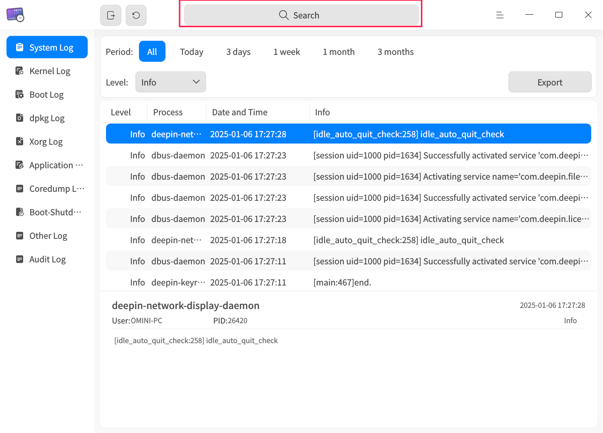
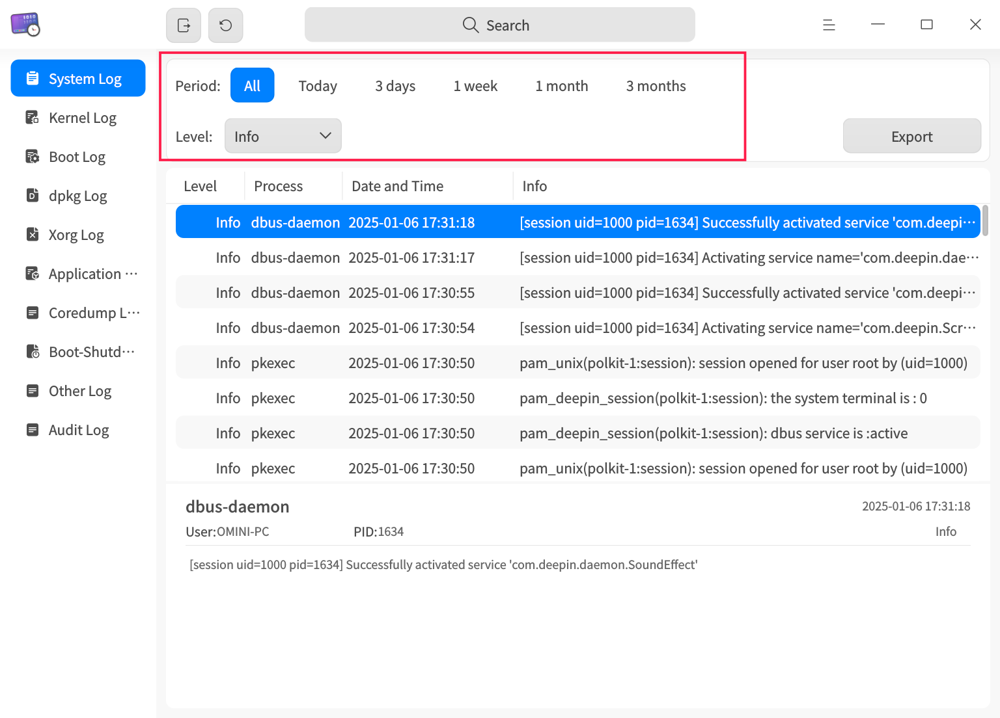
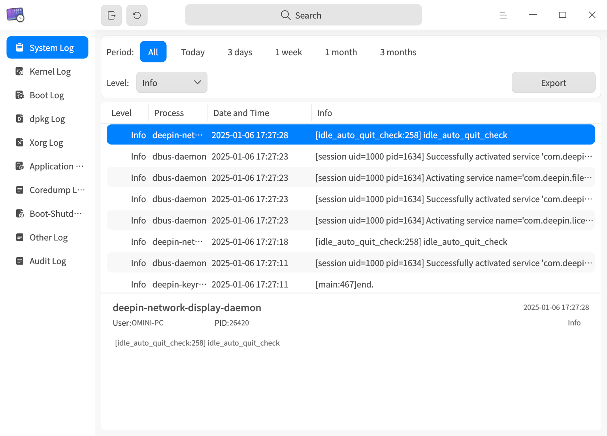
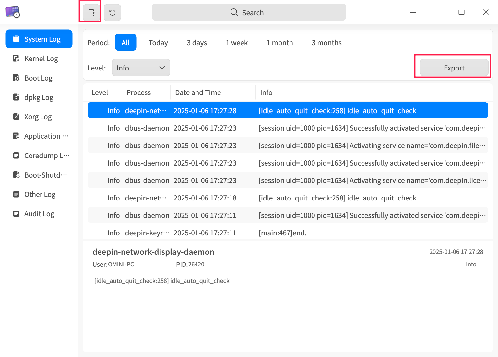
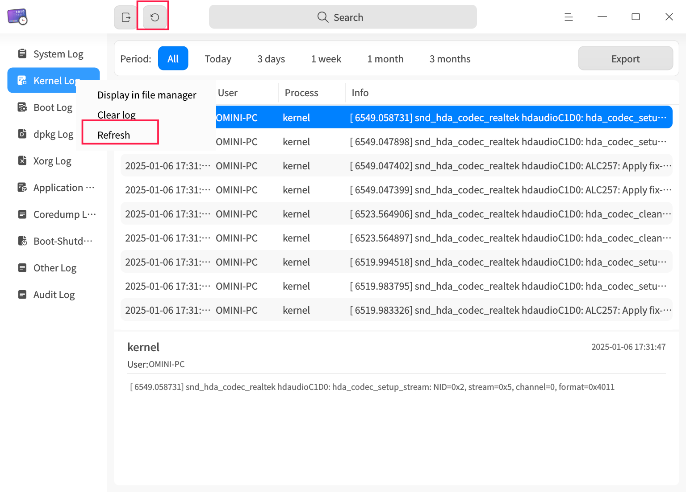
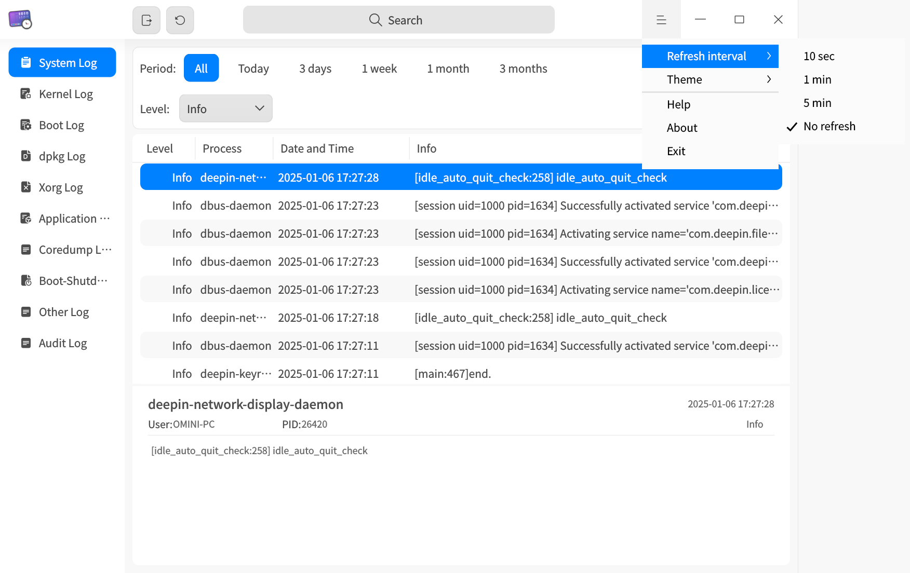
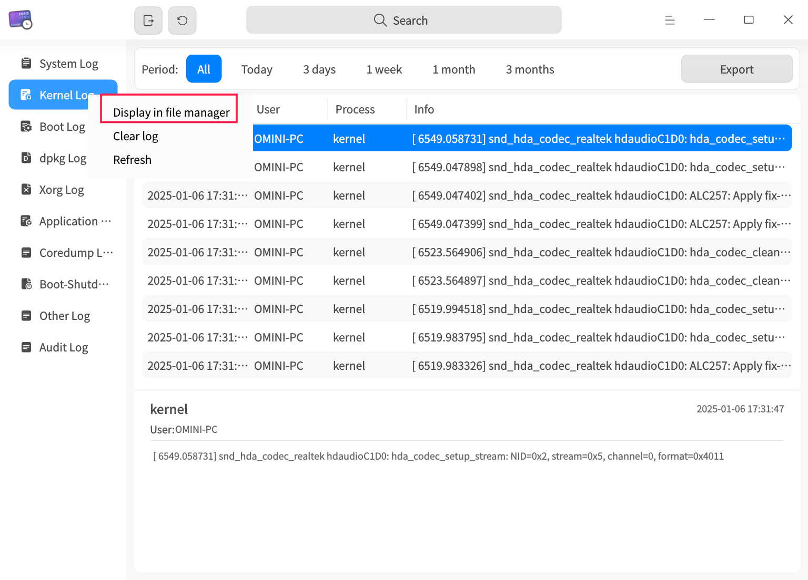
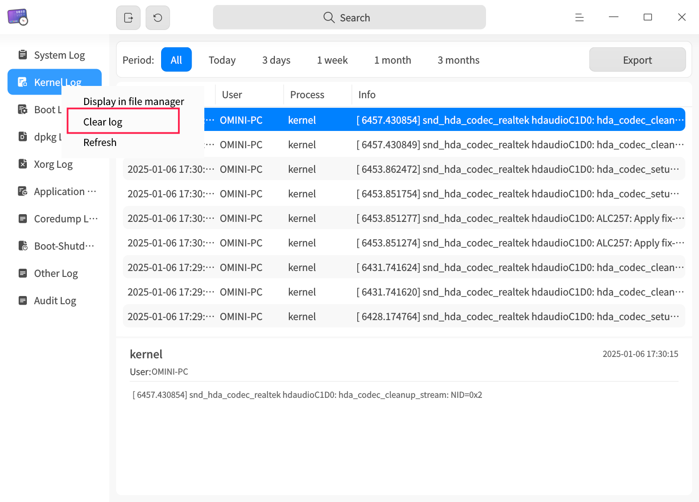

# Log Viewer|deepin-log-viewer|

## Overview

The Log Collection Tool is a utility designed to gather logs generated during program execution, such as information related to operating system and application startup and runtime operations. By analyzing detailed log information, you can quickly identify and resolve issues.

## Getting Started

You can start, exit the Log Collection Tool, or create shortcuts using the following methods.

### Starting the Log Collection Tool

1. Click the Launcher icon  on the taskbar to enter the Launcher interface.
2. Scroll the mouse wheel or use the search function to locate the Log Collection Tool icon , then click to start.
3. Right-click the icon  to perform the following actions:
   - Click **Send to Desktop** to create a desktop shortcut.
   - Click **Pin to Taskbar** to pin the application to the taskbar.
   - Click **Start on Boot** to add the application to the startup items, enabling it to launch automatically when the computer starts.

### Exiting the Log Collection Tool

- On the Log Collection Tool main interface, click  to exit.
- Right-click the icon  on the taskbar and select **Close All** to exit.
- On the Log Collection Tool main interface, click  and select **Exit** to exit.

## Operation Guide

>  The Log Collection Tool supports multiple log types. Due to differences in system versions or architectures, the available log types may vary. Please refer to the actual interface for specific functionalities.
>
>  Depending on the log type, available filtering options, whether the log can be displayed in the file manager, and whether log clearing is supported may differ. Please refer to the actual interface for specific functionalities.
>
> The following sections will use system logs and kernel logs as examples to illustrate the operation of the Log Collection Tool.

### Searching Logs

1. In the Log Collection Tool search box, click .
2. Enter keywords to display search results in real-time.
3. Click  to clear the search box.
   

### Filtering Logs

1. In the top filter bar of the Log Collection Tool, select the desired filtering options.
2. After clicking or selecting the filter options, the Log Collection Tool will immediately display the filtered results.
   

### Viewing Logs

1. On the Log Collection Tool main interface, click the desired log type menu. The right-side list will display all log entries under the selected log type.
2. Left-click a log entry to view its detailed information at the bottom of the tool.
   

### Custom Logs

The Custom Logs feature allows you to add log files to the Log Collection Tool for viewing and exporting. Custom logs support both Gsettings and Dconfig configurations.

**Gsettings Configuration**

1. Execute the Gsettings configuration command in the terminal, specifying the log file paths within the brackets, e.g., `['a.log','b.log','c.log']`.

   ```shell
   gsettings set com.deepin.log.viewer customlogfiles []
   ```

2. On the Log Collection Tool main interface, click **Custom Logs** to view the configured log files.

**Dconfig Configuration**

1. Execute the Dconfig configuration command in the terminal, specifying the log file paths within the brackets, e.g., `["a.log","b.log","c.log"]`.

   ```shell
   dde-dconfig --set -a org.deepin.log.viewer -r org.deepin.log.viewer -k customLogFiles -v '["a.log","b.log","c.log"]'
   ```

2. On the Log Collection Tool main interface, click **Custom Logs** to view the configured log files.

### Exporting Logs

The Export Logs feature allows you to save log query results locally for analysis and troubleshooting.

1. Select a log type and click the **Export** button in the upper-right corner of the interface.
2. If a password authentication window appears, enter the user login password and click **OK**.
3. In the pop-up window, select the storage location and click **Save**.

>  Note: You can also click the full export button  on the title bar to export all logs.
>
> 

### Refreshing Logs

Log refreshing can be done manually or automatically, with customizable intervals for automatic refreshing.

#### Manual Refresh

Click the immediate refresh button  on the title bar, or right-click a log type and select **Refresh** to manually refresh the logs.


#### Automatic Refresh

1. On the Log Collection Tool main interface, click  > **Refresh Frequency**.
2. Select an automatic refresh interval: **Every 10 seconds**, **Every 1 minute**, or **Every 5 minutes**. The Log Collection Tool will refresh automatically according to the selected interval. Choose **Do Not Refresh** to disable automatic refreshing.
   

### Show in File Manager

The **Show in File Manager** feature allows you to view the original log files for certain logs.

1. Right-click a log type in the left navigation bar of the Log Collection Tool.
2. Select **Show in File Manager**, and the system will navigate to the storage location of the current log.
   

### Clearing Logs

1. Right-click a log type in the left navigation bar of the Log Collection Tool.
2. Select **Clear Logs**.
3. In the "Confirm Clear Logs?" prompt, click **OK**.
4. If a password authentication window appears, enter the user login password and click **OK**.
   

## Main Menu

In the main menu, you can [set the refresh frequency](#automatic-refresh), switch window themes, view the help manual, and more.

### Theme

Window themes include Light, Dark, and System themes.

1. On the Log Collection Tool main interface, click .
2. Select **Theme**, then choose a theme color.

### Help

View the help manual to learn more about and use the Log Collection Tool.

1. On the Log Collection Tool main interface, click .
2. Select **Help**.
3. View the detailed help manual for the Log Collection Tool.

### About

1. On the Log Collection Tool main interface, click .
2. Select **About**.
3. View the version information and feature descriptions of the Log Collection Tool.

### Exit

1. On the Log Collection Tool main interface, click .
2. Select **Exit**.
