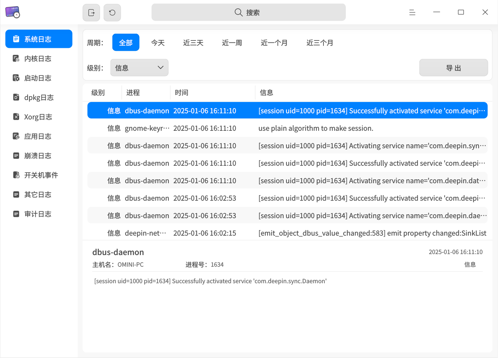
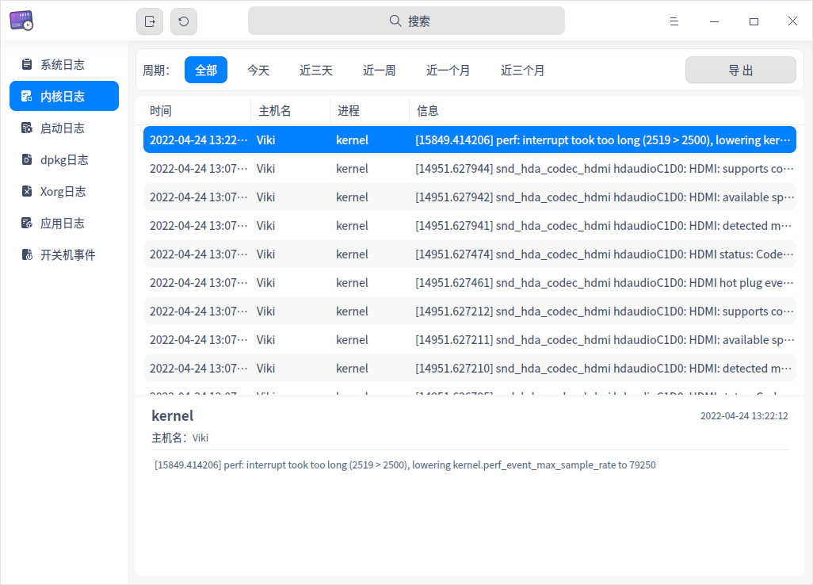
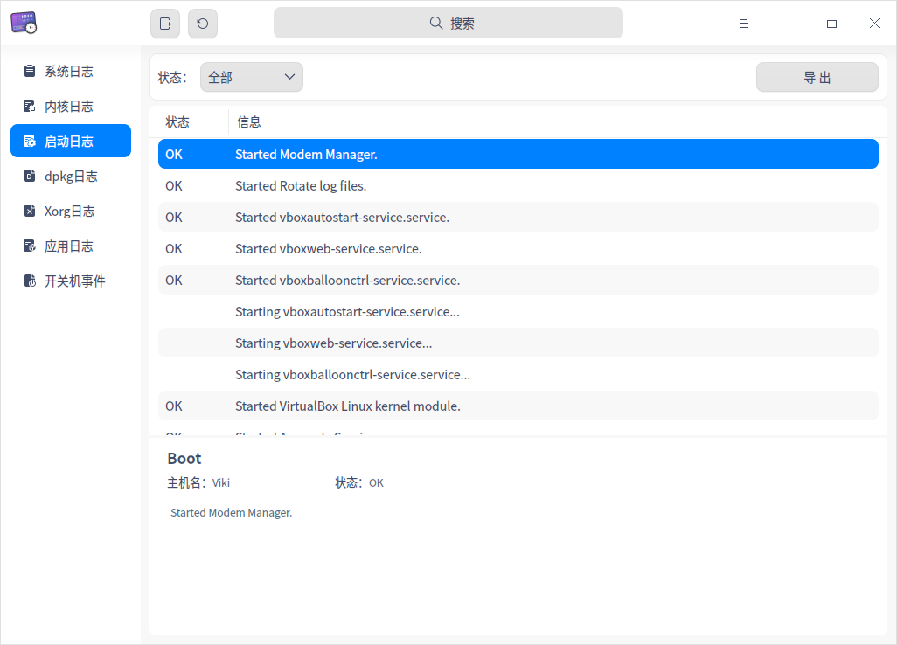
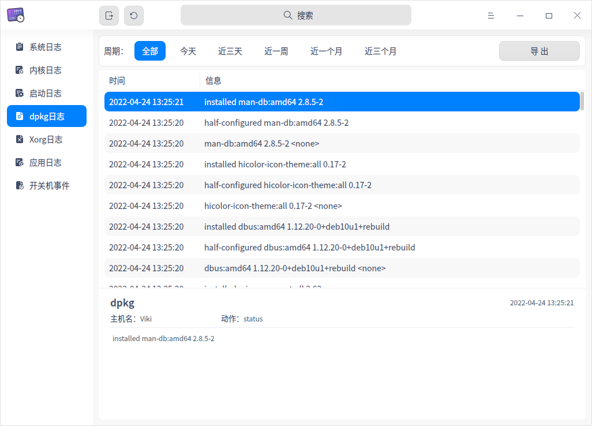
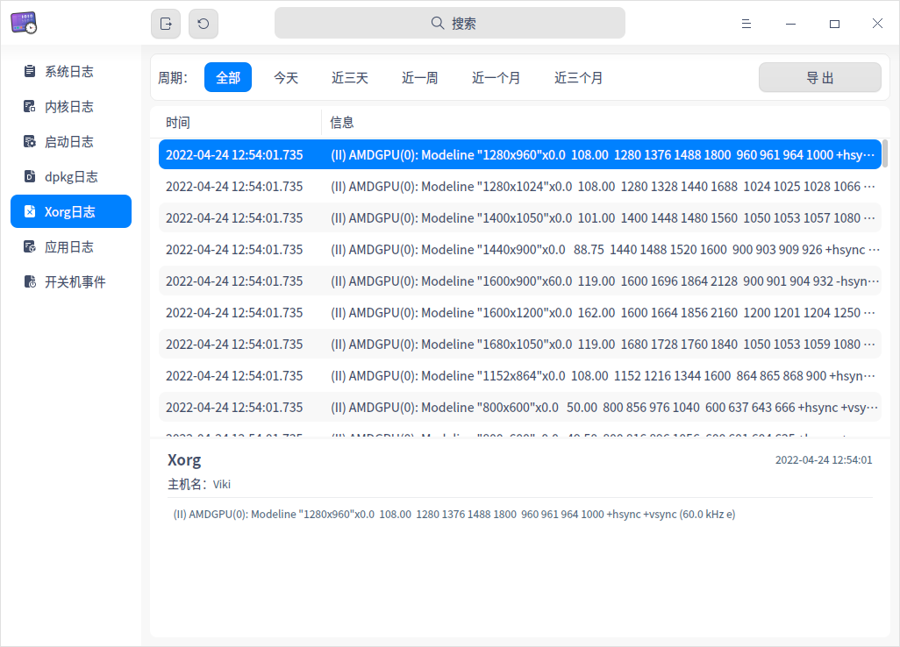
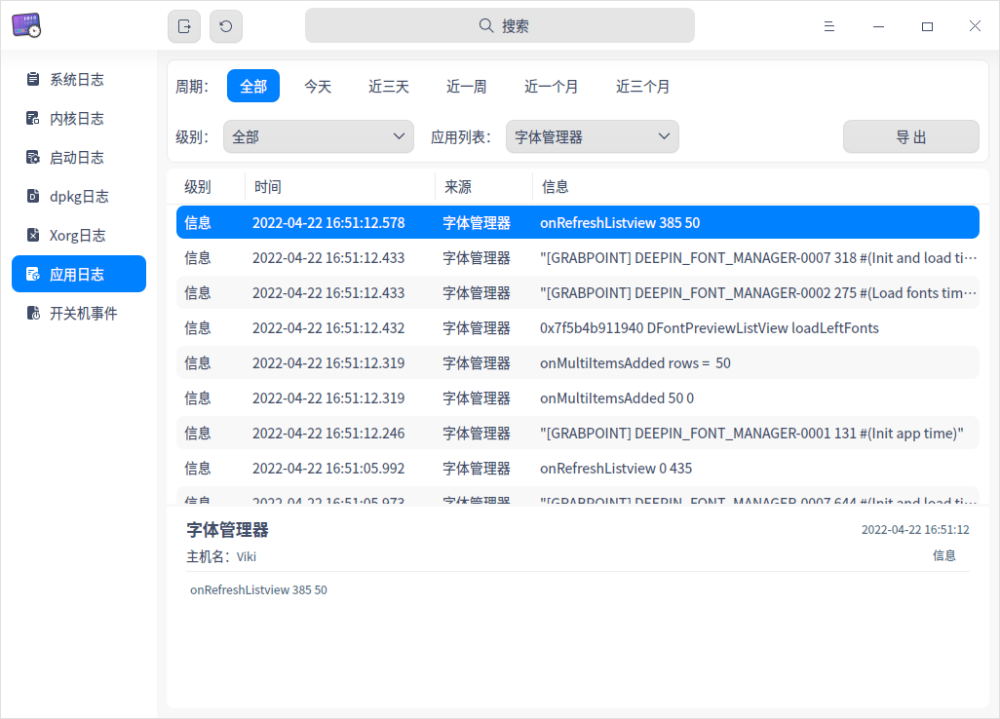
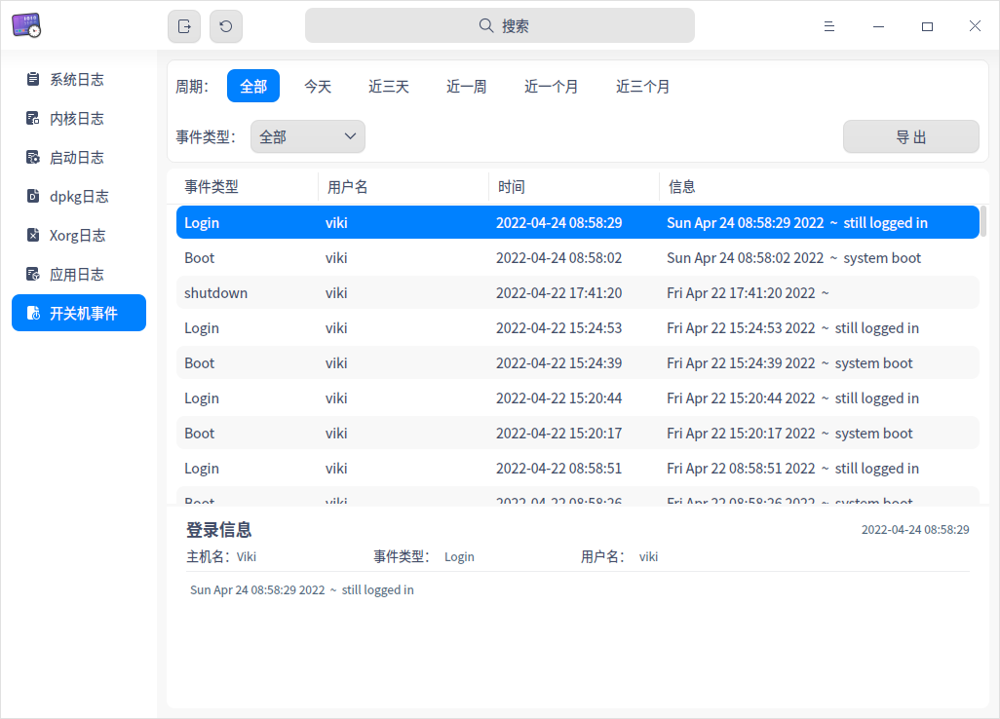
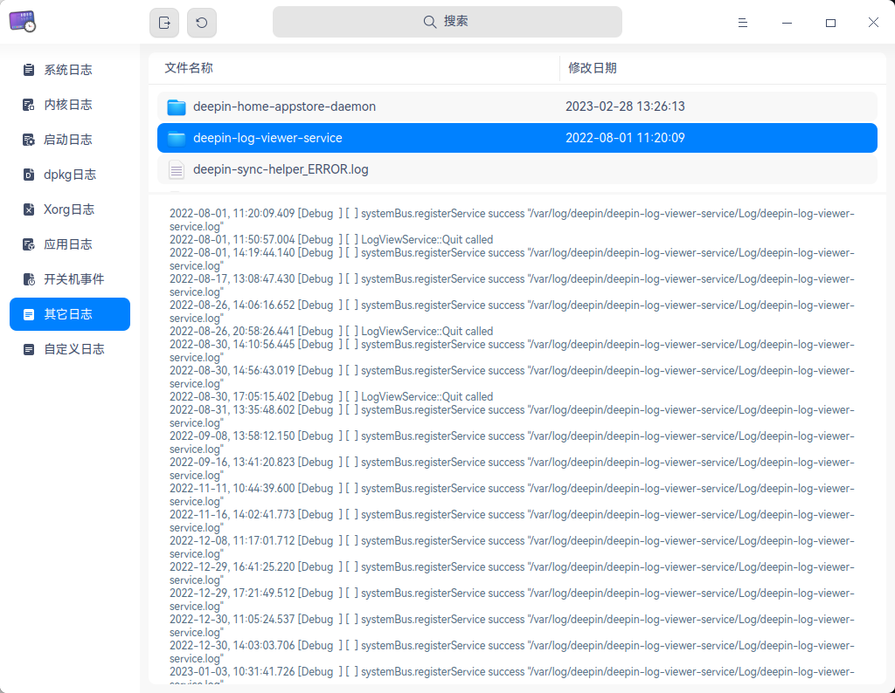
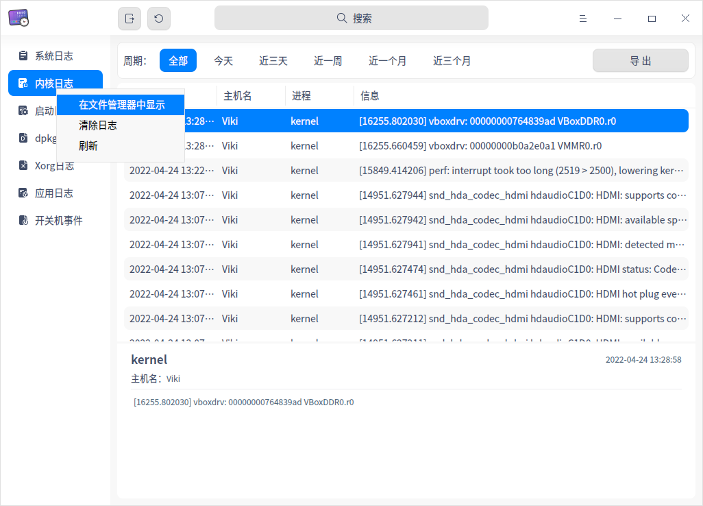

# 日志收集工具|deepin-log-viewer|

## 概述

日志收集工具是负责收集程序运行时所产生日志的小工具，如操作系统和应用程序在启动、运行等过程中的相关信息。您可以通过分析详细日志信息，快速地找到故障原因并解决问题。


## 使用入门

您可以通过以下方式运行或关闭日志收集工具，或者创建快捷方式。

### 运行日志收集工具

1. 单击任务栏上的启动器图标 ，进入启动器界面。
2. 上下滚动鼠标滚轮浏览或通过搜索，找到日志收集工具图标 ，单击运行。
3. 右键单击 ，您可以：
   - 单击 **发送到桌面**，在桌面创建快捷方式。
   - 单击 **发送到任务栏**，将应用程序固定到任务栏。
   - 单击 **开机自动启动**，将应用程序添加到开机启动项，在电脑开机时自动运行该应用程序。

### 关闭日志收集工具

- 在日志收集工具界面，单击 ，退出日志收集工具。
- 在任务栏上右键单击  ，选择 **关闭所有**，退出日志收集工具。
- 在日志收集工具界面单击 ，选择 **退出**，退出日志收集工具。

## 操作介绍

### 搜索日志

1. 在日志收集工具搜索框中，单击 。
2. 输入关键字，实时显示搜索结果。
3. 单击  ，则清空搜索内容。


### 筛选日志

您可以通过 **周期**、**级别**、**状态**、**应用列表** 或 **事件类型** 来筛选日志。
<table border="1">
   <tr>
    <th>类型</th>
 <th>说明 </th>
</tr>
   <tr>
    <td>按周期筛选</td>
    <td>按日志生成的时间顺序进行筛选。
      <ul>
          <li>选项包括：全部、今天、近三天、近一周、近一个月、近三个月，默认选项为全部。</li>
          <li>适用类型：除了启动日志没有显示时间外，其他类型的日志都支持按周期筛选。</li>
      </ul>
 </td>
</tr>
   <tr>
    <td>按级别筛选</td>
    <td>按照事件的级别高低进行筛选。
    <ul>
          <li>选项包括：全部、紧急、严重警告、严重、错误、警告、注意、信息、调试，默认选项为信息。</li>
          <li>适用类型：系统日志、应用日志。</li>
      </ul>
      <tr>
    <td>按状态筛选</td>
    <td>
    <ul>
          <li>选项包括：全部、OK、Failed，默认选项为全部。</li>
          <li>适用类型：仅适用于启动日志。</li>
      </ul>
          <tr>
    <td>按应用列表筛选</td>
    <td>
        适用类型：仅适用于应用日志，对应用程序的log文件进行筛选，默认选项为第一个应用程序。 </td>
              <tr>
    <td>按事件类型筛选</td>
    <td>
    <ul>
          <li>选项包括：全部、登录、开机、关机，默认选项为全部。</li>
          <li>适用类型：仅适用于开关机事件。</li>
      </ul>
 </td>
   </tr>
   </table>


### 查看日志

#### 查看系统日志

1. 在日志收集工具界面，单击 **系统日志**。
2. 查看系统日志的级别、进程、时间和信息。
3. 选中某条日志后，可查看该日志的详细信息，包括进程、时间、主机名、进程号、级别和详细信息。



#### 查看内核日志

1. 在日志收集工具界面，单击 **内核日志**。
2. 弹出“密码认证”窗口，输入用户登录密码后单击 **确定**。
3. 查看内核日志的时间、主机名、进程和信息。
4. 选中某条日志后，可查看该日志的详细信息，包括进程、时间、主机名和详细信息。



#### 查看启动日志

1. 在日志收集工具界面，单击 **启动日志**。
2. 弹出“密码认证”窗口，输入用户登录密码后单击 **确定**。
3. 查看启动日志的状态和信息。
4. 选中某条日志后，可查看该日志的详细信息，包括主机名、状态和详细信息。



#### 查看dpkg日志

1. 在日志收集工具界面，单击 **dpkg日志**。
2. 查看dpkg日志的时间和信息。
3. 选中某条日志后，可查看该日志的详细信息，包括时间、主机名、动作和详细信息。



#### 查看Xorg日志

1. 在日志收集工具界面，单击 **Xorg日志**。
2. 查看Xorg日志的时间和信息。
3. 选中某条日志后，可查看该日志的详细信息，包括时间、主机名和详细信息。



#### 查看应用日志

1. 在日志收集工具界面，单击 **应用日志**。
2. 查看应用日志的级别、时间、来源和信息。
3. 选中某条日志后，可查看该日志的详细信息，包括来源、时间 、主机名、级别和详细信息。



#### 查看开关机事件

1. 在日志收集工具界面，单击 **开关机事件**。
2. 查看开关机事件的事件类型、用户名、时间和信息。
3. 选中某条日志后，可查看该日志的详细信息，包括时间、主机名、事件类型、用户名和详细信息。



#### 查看其它日志

1. 在日志收集工具界面，单击 **其它日志**。
2. 其它日志以文件列表方式展示日志文件的文件名称、修改日期。同类日志文件以文件夹方式展示。
3. 选中某个文件后，可查看该文件的详细内容。拖拽文件列表和详细内容分界线，可以同步调整两区域大小。




### 自定义日志

自定义日志功能是将日志文件添加至日志收集工具进行查看、导出。自定义日志兼容Gsettings配置和Dconfig配置。

**Gsettings配置**

1. 在终端执行Gsettings配置设置命令，“[]”中填写日志文件路径，比如：['a.log','b.log','c.log']。

```shell
gsettings set com.deepin.log-viewer customlogfiles []
```

2. 在日志收集工具界面，单击**自定义日志**，即可发现已有配置。

**Dconfig配置**

1. 在终端执行Dconfig配置设置命令，"[]"中填写日志文件路径，比如：["a.log","b.log","c.log"]

```shell
dde-dconfig --set -a org.deepin.deepin-log-viewer -r org.deepin.deepin-log-viewer -k customLogFiles -v '["a.log","b.log","c.log"]'
```

2. 在日志收集工具界面，单击**自定义日志**，即可发现已有配置。

### 导出日志

导出日志功能是将日志查询结果导出到本地，帮助您分析、定位和解决问题。


1. 选择某一日志类型，单击界面右上角 **导出** 按钮。
2. 如果弹出密码认证窗口，输入用户登录密码后单击 **确定**。
3. 在弹出的窗口中，选择存储位置，单击 **保存**。

> 说明：您也可以单击标题栏上的全部导出按钮 ，将系统日志、内核日志、启动日志、dpkg日志、Xorg日志、应用日志和开关机事件的日志全部导出。

### 刷新日志

刷新日志分为手动刷新和自动刷新，如果是自动刷新日志，还可以设置自动刷新的频率。

#### 手动刷新日志

单击标题栏上的立即刷新按钮 ；或右键单击某一日志类型，选择 **刷新**，刷新日志。

#### 自动刷新日志

1. 在日志收集工具界面，单击  > **刷新频率**。
2. 选择自动刷新的频率：**每10秒**、**每1分钟** 或 **每5分钟**， 刷新日志。

   如果选择 **不刷新**，表示停止自动刷新日志。

### 在文件管理器中显示

在日志收集工具中仅内核日志、启动日志、dpkg日志、Xorg日志和应用日志支持 **在文件管理器中显示** 的功能。

1. 在日志收集工具左侧导航栏中，右键单击某一日志类型。
2. 选择 **在文件管理器中显示**，定位到当前日志的存储位置。





### 清除日志

在日志收集工具中仅内核日志、启动日志、dpkg日志、Xorg日志和应用日志支持 **清除日志** 的功能。
1. 在日志收集工具左侧导航栏中，右键单击某一日志类型。
2. 选择 **清除日志**。
3. 弹出“确定清除日志”提示框，单击 **确定**。
4. 如果弹出密码认证窗口，输入用户登录密码后单击 **确定**。


## 主菜单

在主菜单中，您可以 [设置刷新频率](#自动刷新日志)、切换窗口主题，查看帮助手册等。

### 主题

窗口主题包含浅色主题、深色主题和系统主题。

1. 在日志收集工具界面，单击 。
2. 选择 **主题**，选择一个主题颜色。


### 帮助

查看帮助手册，进一步了解和使用日志收集工具。

1. 在日志收集工具界面，单击 。
2. 选择 **帮助**。
3. 查看日志收集工具的帮助手册。


### 关于

1. 在日志收集工具界面，单击 。
2. 选择 **关于**。
3. 查看日志收集工具的版本和介绍。

### 退出

1. 在日志收集工具界面，单击 。
2. 选择 **退出**。

