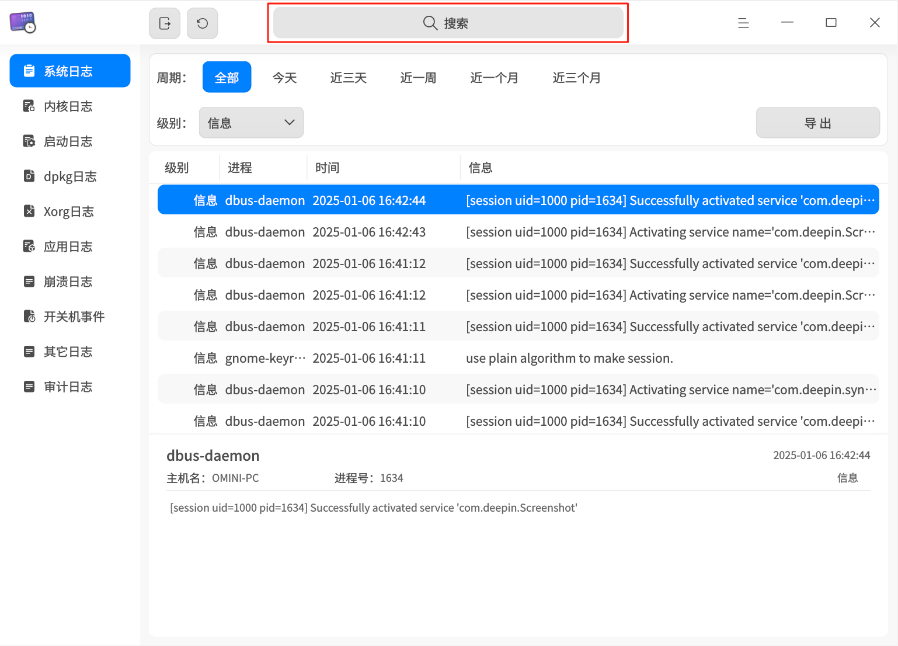
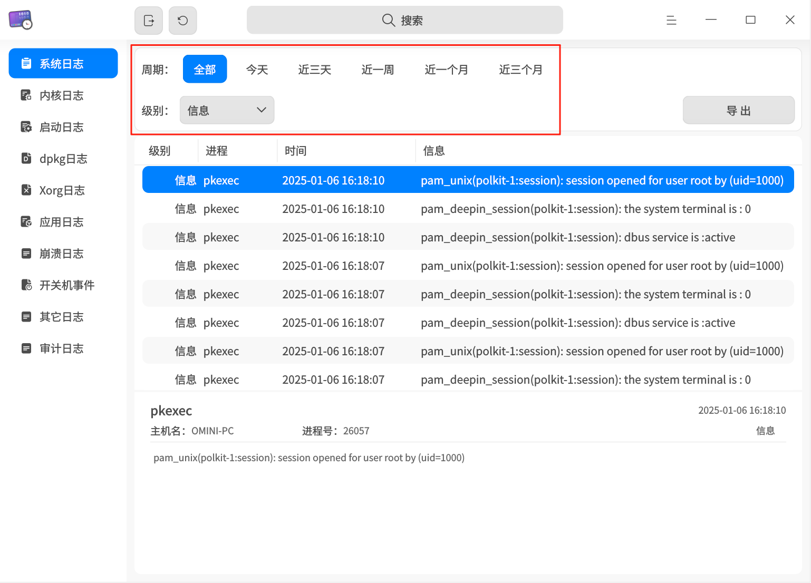
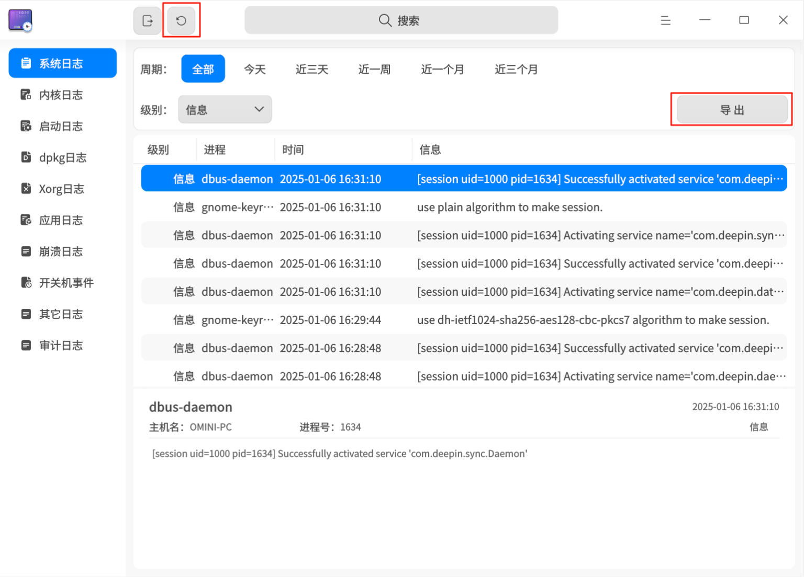
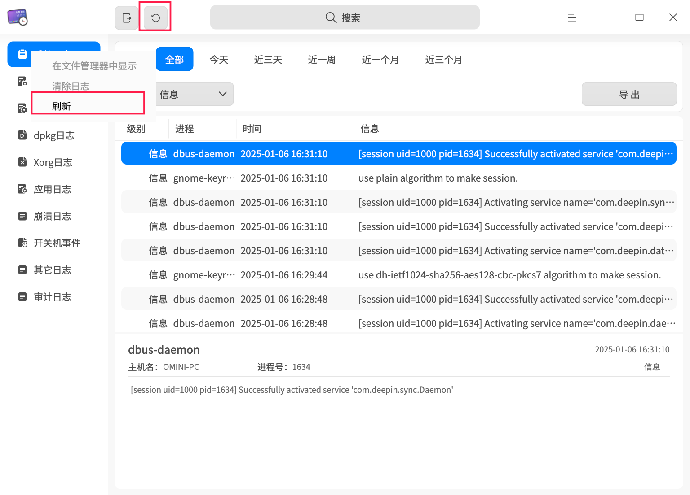
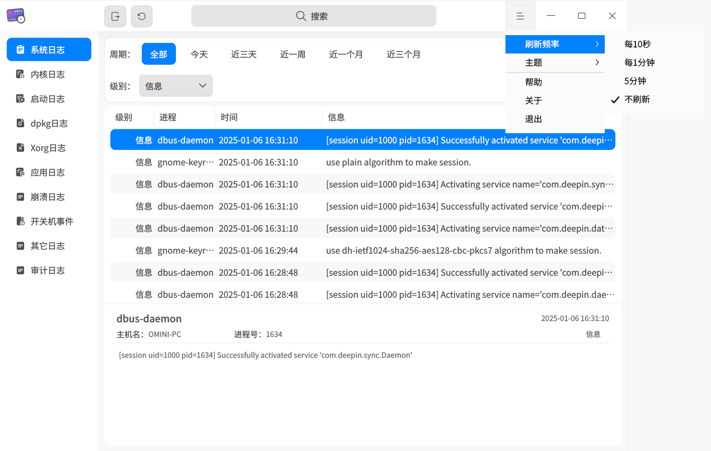
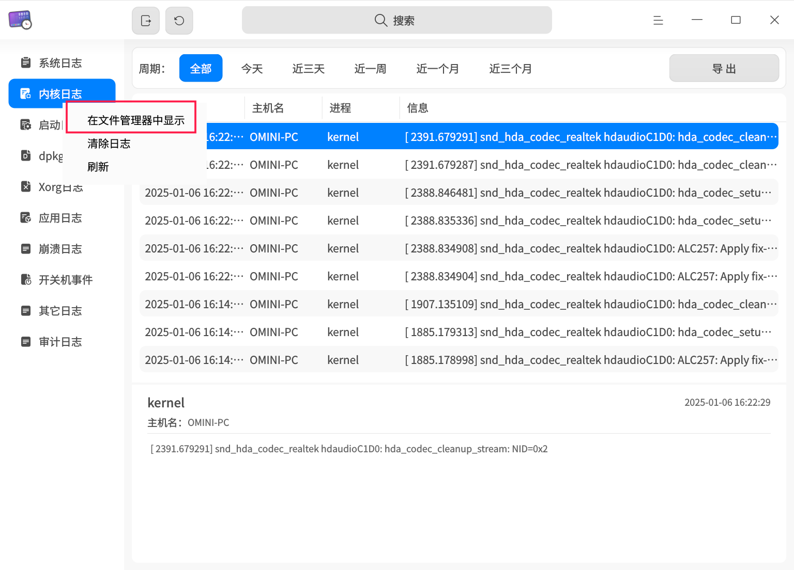
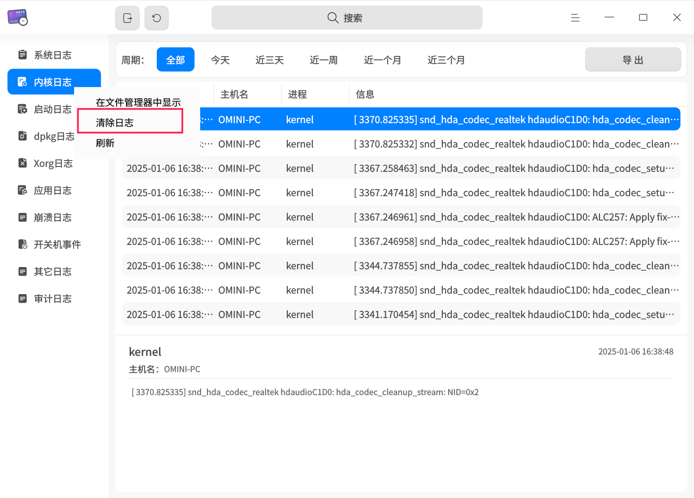

# 日志收集工具|deepin-log-viewer|

## 概述

日志收集工具是负责收集程序运行时所产生日志的小工具，如操作系统和应用程序在启动、运行等过程中的相关信息。您可以通过分析详细日志信息，快速地找到故障原因并解决问题。

## 使用入门

您可以通过以下方式运行、关闭日志收集工具，或创建快捷方式。

### 运行日志收集工具

1. 单击任务栏上的启动器图标 ，进入启动器界面。
2. 上下滚动鼠标滚轮浏览或通过搜索，找到日志收集工具图标 ，单击运行。
3. 右键单击 ，您可以：
   - 单击 **发送到桌面**，在桌面创建快捷方式。
   - 单击 **发送到任务栏**，将应用程序固定到任务栏。
   - 单击 **开机自动启动**，将应用程序添加到开机启动项，在电脑开机时自动运行该应用程序。

### 关闭日志收集工具

- 在日志收集工具界面，单击 ，退出日志收集工具。
- 在任务栏上右键单击  ，选择 **关闭所有**，退出日志收集工具。
- 在日志收集工具界面单击 ，选择 **退出**，退出日志收集工具。

## 操作介绍

>  日志收集工具支持多种日志类型的展示。由于系统版本或架构的不同，可查看的日志类型可能有所差异，具体功能请以最终页面显示内容为准。
>
>  由于日志类型的不同，提供的筛选项、是否能在文件管理器中显示及是否支持清除日志的功能也有所区别，具体功能请参照最终页面的显示内容。
>
> 下文将以系统日志和内核日志 **为例** ，介绍日志收集工具的操作方式。

### 搜索日志

1. 在日志收集工具搜索框中，单击 。
2. 输入关键字，实时显示搜索结果。
3. 单击  ，则清空搜索内容。



### 筛选日志

1. 在日志收集工具顶部筛选栏中，选择需要筛选的选项。
2. 点击或选择筛选项后，日志收集工具将立即展示筛选结果。



### 查看日志

1. 在日志收集工具界面，单击 需要查看的日志类型菜单，工具右侧列表会展示当前日志类型下所有的日志。
3. 鼠标左键单击某条日志后，可在工具下方查看该日志的详细信息。


### 自定义日志

自定义日志功能允许您将日志文件添加到日志收集工具中进行查看和导出。自定义日志兼容Gsettings配置和Dconfig配置。

**Gsettings配置**

1. 在终端执行Gsettings配置设置命令，“[]”中填写日志文件路径，比如：['a.log','b.log','c.log']。

```shell
gsettings set com.deepin.log.viewer customlogfiles []
```

2. 在日志收集工具界面，单击**自定义日志**，即可发现已有配置。

**Dconfig配置**

1. 在终端执行Dconfig配置设置命令，"[]"中填写日志文件路径，比如：["a.log","b.log","c.log"]

```shell
dde-dconfig --set -a org.deepin.log.viewer -r org.deepin.log.viewer -k customLogFiles -v '["a.log","b.log","c.log"]'
```

2. 在日志收集工具界面，单击**自定义日志**，即可发现已有配置。

### 导出日志

导出日志功能是将日志查询结果导出到本地，帮助您分析、定位和解决问题。


1. 选择某一日志类型，单击界面右上角 **导出** 按钮。
2. 如果弹出密码认证窗口，输入用户登录密码后单击 **确定**。
3. 在弹出的窗口中，选择存储位置，单击 **保存**。

> 说明：您也可以单击标题栏上的全部导出按钮 ，将全量的日志导出。



### 刷新日志

刷新日志分为手动刷新和自动刷新，自动刷新日志的频率可以自定义。

#### 手动刷新日志

单击标题栏上的立即刷新按钮 ；或右键单击某一日志类型，选择 **刷新**，刷新日志。



#### 自动刷新日志

1. 在日志收集工具界面，单击  > **刷新频率**。

2. 选择自动刷新的频率：**每10秒**、**每1分钟** 或 **每5分钟**， 刷新日志。选择 **不刷新** 即停止自动刷新日志。”



### 在文件管理器中显示

通过 **在文件管理器中显示** 的功能，您可以查看部分日志的原始日志文件。

1. 在日志收集工具左侧导航栏中，右键单击某一日志类型。
2. 选择 **在文件管理器中显示**，定位到当前日志的存储位置。




### 清除日志

1. 在日志收集工具左侧导航栏中，右键单击某一日志类型。
2. 选择 **清除日志**。
3. 弹出“确定清除日志”提示框，单击 **确定**。
4. 如果弹出密码认证窗口，输入用户登录密码后单击 **确定**。




## 主菜单

在主菜单中，您可以 [设置刷新频率](#自动刷新日志)、切换窗口主题，查看帮助手册等。

### 主题

窗口主题包含浅色主题、深色主题和系统主题。

1. 在日志收集工具界面，单击 。
2. 选择 **主题**，选择一个主题颜色。

### 帮助

查看帮助手册，进一步了解和使用日志收集工具。

1. 在日志收集工具界面，单击 。
2. 选择 **帮助**。
3. 查看日志收集工具的帮助手册。

### 关于

1. 在日志收集工具界面，单击 。
2. 选择 **关于**。
3. 查看日志收集工具的版本和介绍。

### 退出

1. 在日志收集工具界面，单击 。
2. 选择 **退出**。

