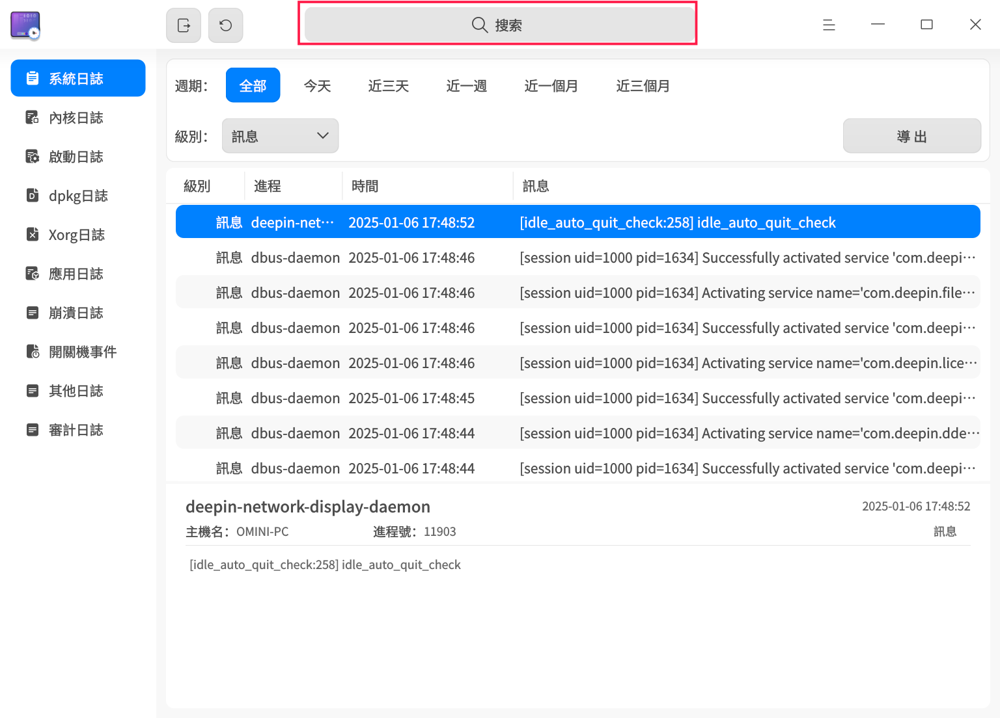
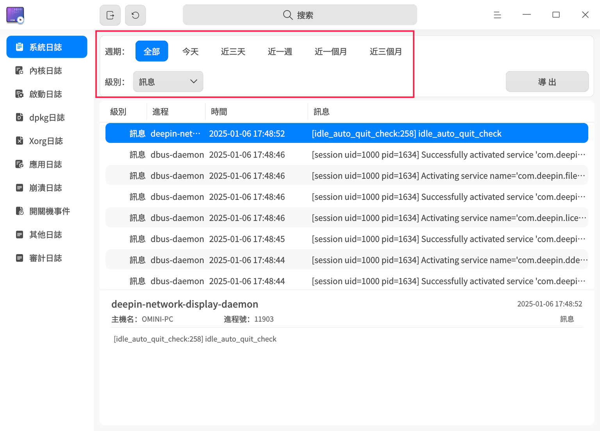
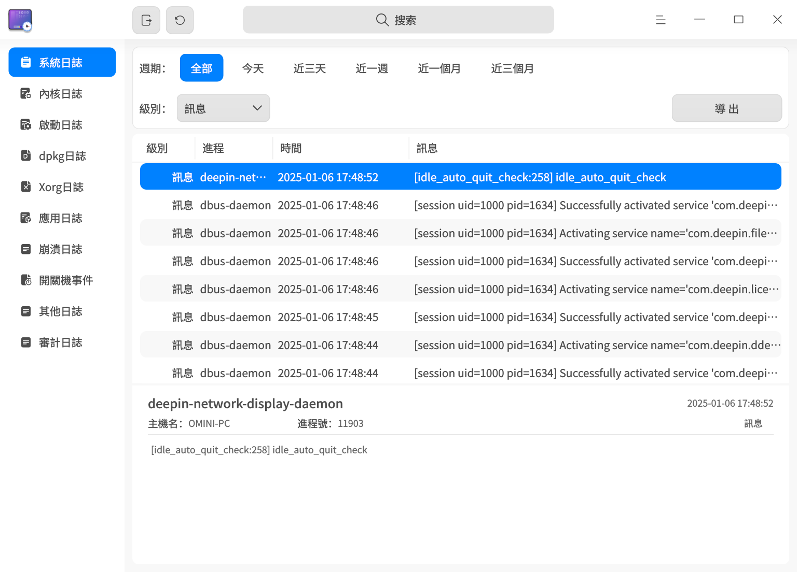
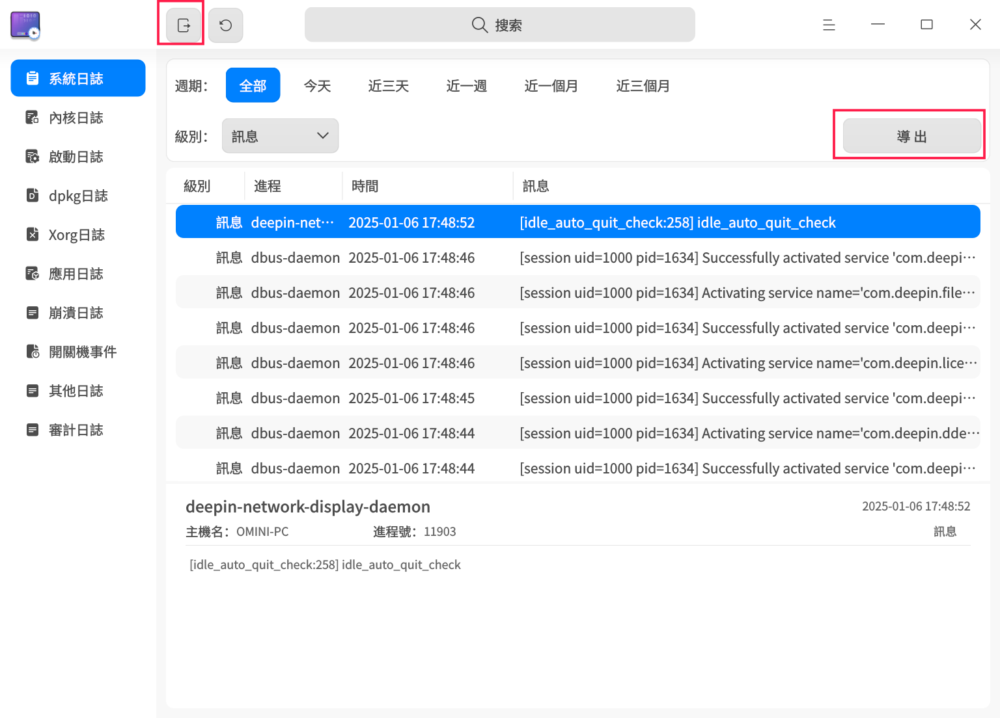
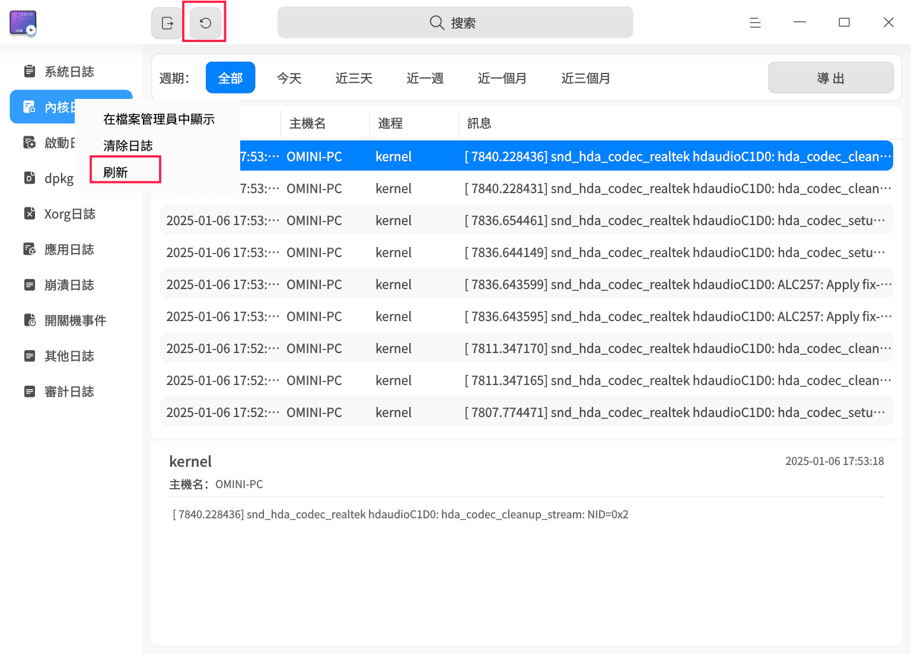
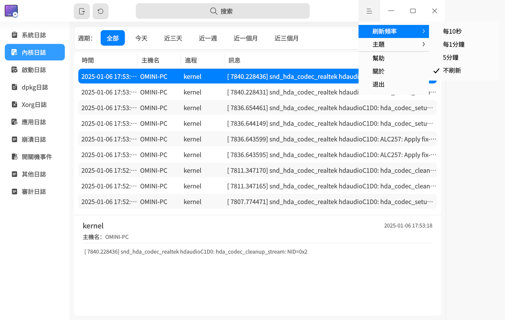
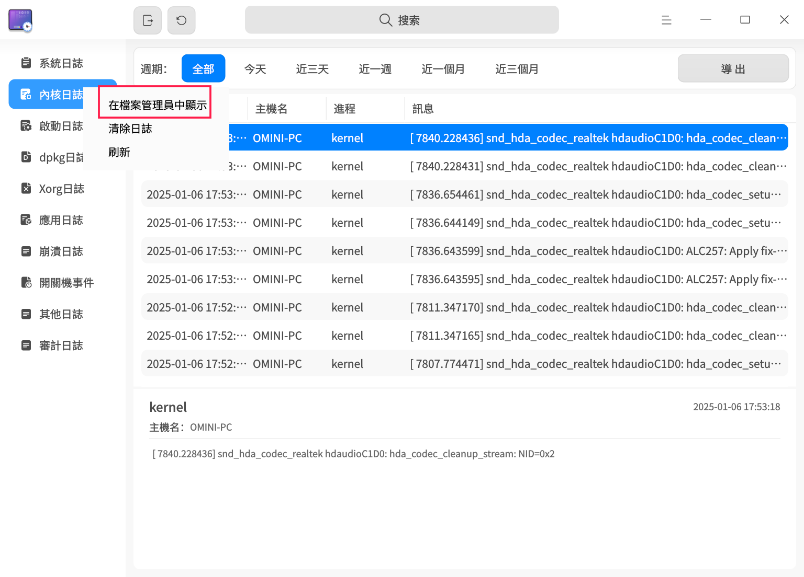
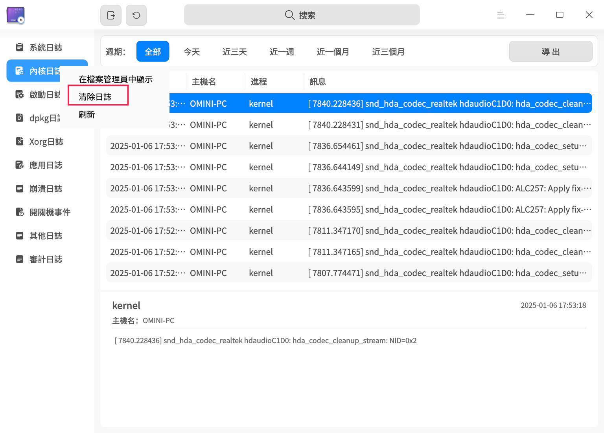

# 日誌收集工具|deepin-log-viewer|

## 概述

日誌收集工具是負責收集程序運行時所產生日誌的小工具，例如操作系統和應用程式在啟動、運行等操作過程中的相關資訊。您可以通過分析詳細的日誌資訊，快速找到故障原因並解決問題。

## 使用入門

您可以通過以下方式啟動、退出日誌收集工具，或創建快捷方式。

### 啟動日誌收集工具

1. 單擊任務欄上的啟動器圖標 ，進入啟動器界面。
2. 上下滾動鼠標滾輪瀏覽或通過搜索功能，找到日誌收集工具圖標，單擊啟動。
3. 右鍵單擊圖標 ，您可以執行以下操作：
   - 單擊 **發送到桌面**，在桌面創建快捷方式。
   - 單擊 **發送到任務欄**，將應用程式固定到任務欄。
   - 單擊 **開機自動啟動**，將應用程式添加到開機啟動項，在電腦開機時自動啟動該應用程式。

### 退出日誌收集工具

- 在日誌收集工具主界面，單擊 ，退出日誌收集工具。
- 在任務欄上右鍵單擊圖標 ，選擇 **關閉所有**，退出日誌收集工具。
- 在日誌收集工具主界面單擊 ，選擇 **退出**，退出日誌收集工具。

## 操作介紹

>  日誌收集工具支持多種日誌類型的展示。由於系統版本或架構的不同，可查看的日誌類型可能有所差異，具體功能請以最終頁面顯示內容為準。
>
>  由於日誌類型的不同，提供的篩選項、是否能在文件管理器中顯示及是否支持清除日誌的功能也有所區別，具體功能請參照最終頁面的顯示內容。
>
> 下文將以系統日誌和內核日誌為例，介紹日誌收集工具的操作方式。

### 搜索日誌

1. 在日誌收集工具搜索框中，單擊 。
2. 輸入關鍵字，實時顯示搜索結果。
3. 單擊 ，清空搜索框中的搜索內容。
   

### 篩選日誌

1. 在日誌收集工具頂部篩選欄中，選擇需要篩選的選項。
2. 單擊或選擇篩選項後，日誌收集工具將立即展示篩選結果。
   

### 查看日誌

1. 在日誌收集工具主界面，單擊需要查看的日誌類型菜單，工具右側列表會展示當前日誌類型下所有的日誌條目。
2. 鼠標左鍵單擊某條日誌後，可在工具下方查看該日誌的詳細資訊。
   

### 自定義日誌

自定義日誌功能允許您將日誌文件添加到日誌收集工具中進行查看和導出。自定義日誌支持 Gsettings 配置和 Dconfig 配置。
**Gsettings 配置**

1. 在終端執行 Gsettings 配置設置命令，在方括號內填寫日誌文件路徑，例如：`['a.log','b.log','c.log']`。

   ```shell
   gsettings set com.deepin.log.viewer customlogfiles []
   ```

2. 在日誌收集工具主界面，單擊 **自定義日誌**，即可查看已配置的日誌文件。

**Dconfig 配置**

1. 在終端執行 Dconfig 配置設置命令，在方括號內填寫日誌文件路徑，例如：`["a.log","b.log","c.log"]`。

   ```shell
   dde-dconfig --set -a org.deepin.log.viewer -r org.deepin.log.viewer -k customLogFiles -v '["a.log","b.log","c.log"]'
   ```

2. 在日誌收集工具主界面，單擊 **自定義日誌**，即可查看已配置的日誌文件。

### 導出日誌

導出日誌功能是將日誌查詢結果導出到本地，幫助您分析、定位和解決問題。

1. 選擇某一日誌類型，單擊界面右上角 **導出** 按鈕。
2. 如果出現密碼認證窗口，輸入用戶登錄密碼後單擊 **確定**。
3. 在彈出的窗口中，選擇存儲位置，單擊 **保存**。

>  說明：您也可以單擊標題欄上的全部導出按鈕 ，將全量的日誌導出。



### 刷新日誌

刷新日誌分為手動刷新和自動刷新，自動刷新日誌的頻率可以自定義設置。

#### 手動刷新日誌

單擊標題欄上的立即刷新按鈕 ；或右鍵單擊某一日誌類型，選擇 **刷新**，手動刷新日誌內容。


#### 自動刷新日誌

1. 在日誌收集工具主界面，單擊  > **刷新頻率**。
2. 選擇自動刷新的頻率：**每10秒**、**每1分鐘** 或 **每5分鐘**，日誌收集工具將按此頻率自動刷新。選擇 **不刷新** 即停止自動刷新功能。
   

### 在文件管理器中顯示

通過 **在文件管理器中顯示** 功能，您可以查看部分日誌的原始日誌文件。

1. 在日誌收集工具左側導航欄中，右鍵單擊某一日誌類型。
2. 選擇 **在文件管理器中顯示**，系統將定位到當前日誌的存儲位置。
   

### 清除日誌

1. 在日誌收集工具左側導航欄中，右鍵單擊某一日誌類型。
2. 選擇 **清除日誌**。
3. 彈出"確定清除日誌？"提示框，單擊 **確定**。
4. 如果出現密碼認證窗口，輸入用戶登錄密碼後單擊 **確定**。
   

## 主菜單

在主菜單中，您可以 [設置刷新頻率](#自動刷新日誌)、切換窗口主題、查看幫助手冊等。

### 主題

窗口主題包含淺色主題、深色主題和系統主題。

1. 在日誌收集工具主界面，單擊 。
2. 選擇 **主題**，選擇一種主題顏色。

### 幫助

查看幫助手冊，進一步了解和使用日誌收集工具。

1. 在日誌收集工具主界面，單擊 。
2. 選擇 **幫助**。
3. 查看日誌收集工具的詳細幫助手冊。

### 關於

1. 在日誌收集工具主界面，單擊 。
2. 選擇 **關於**。
3. 查看日誌收集工具的版本資訊和功能介紹。

### 退出

1. 在日誌收集工具主界面，單擊 。
2. 選擇 **退出**。
