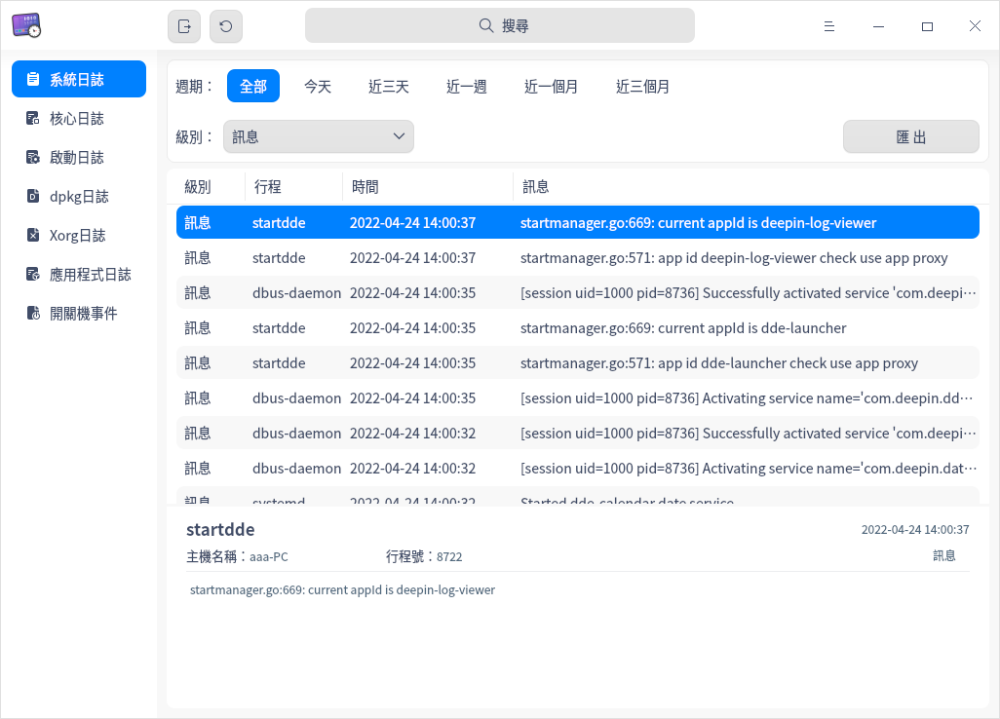
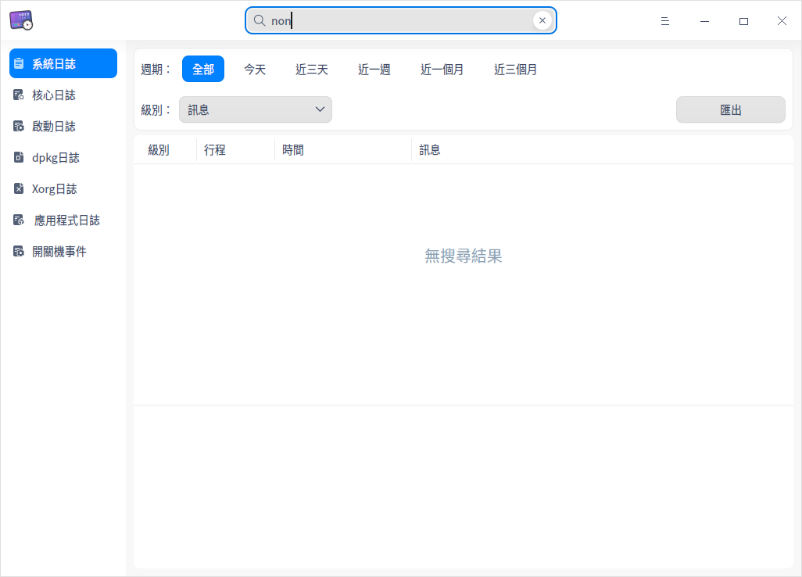
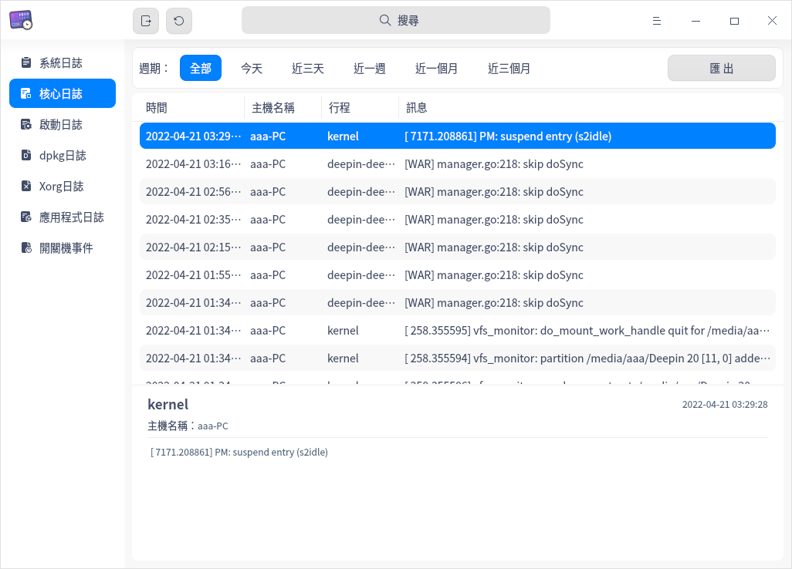
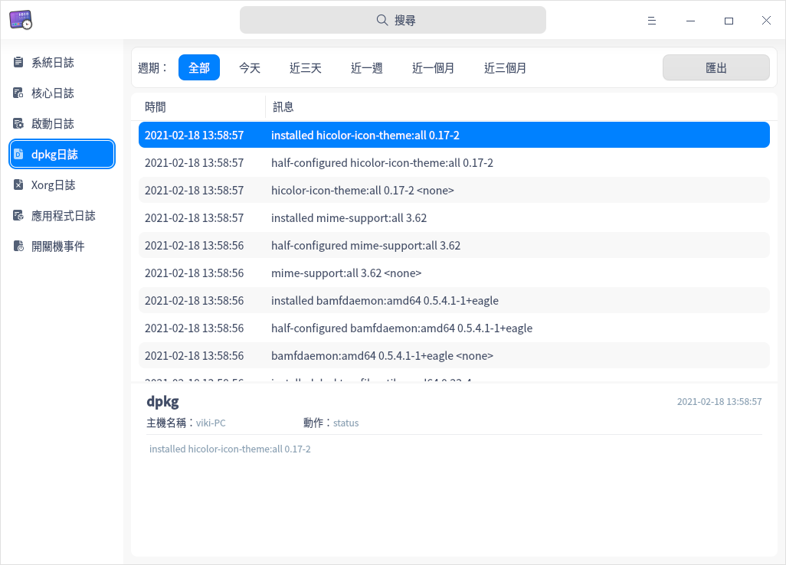
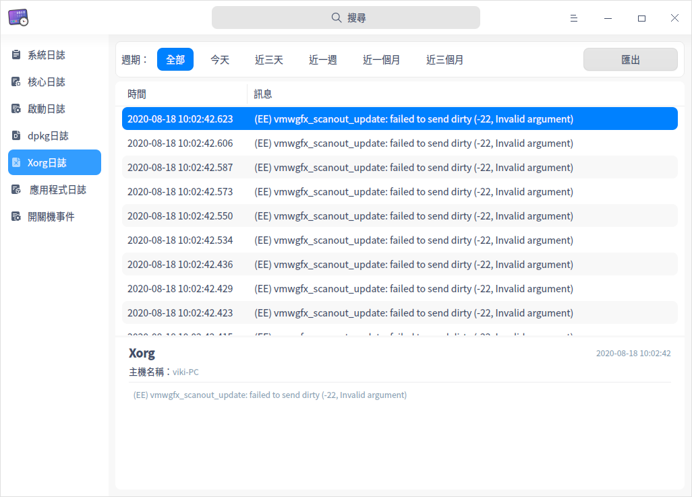
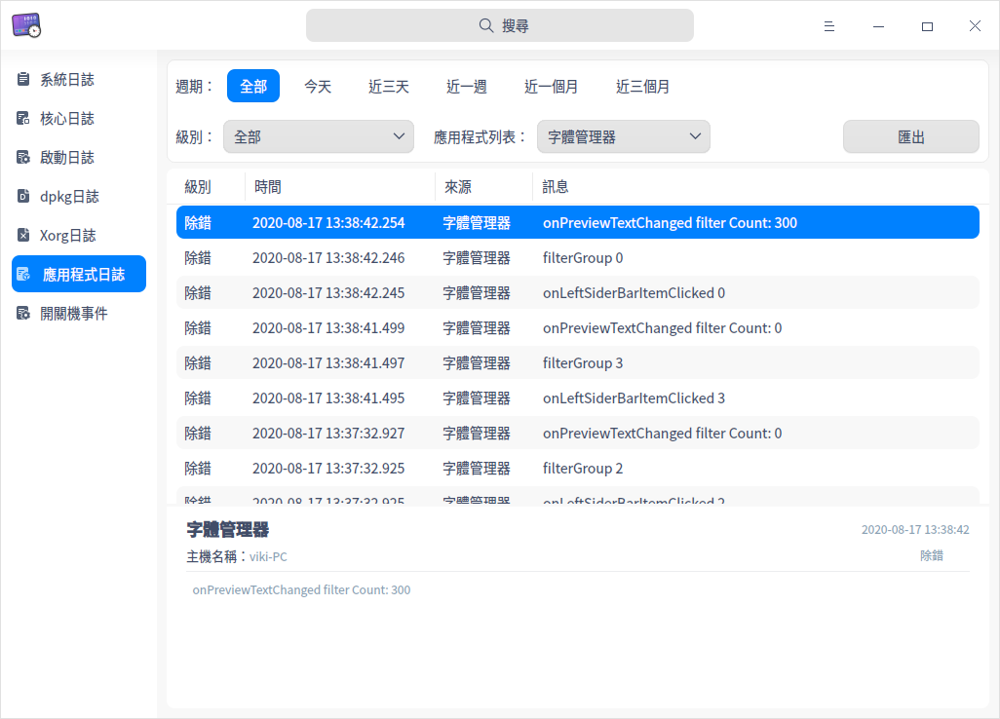
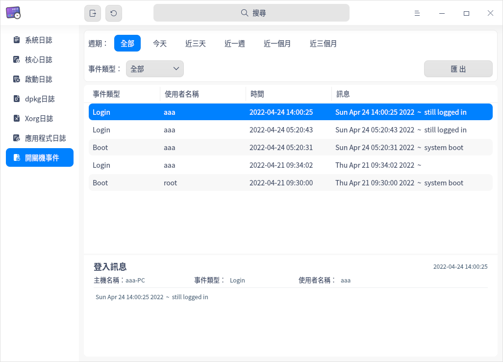
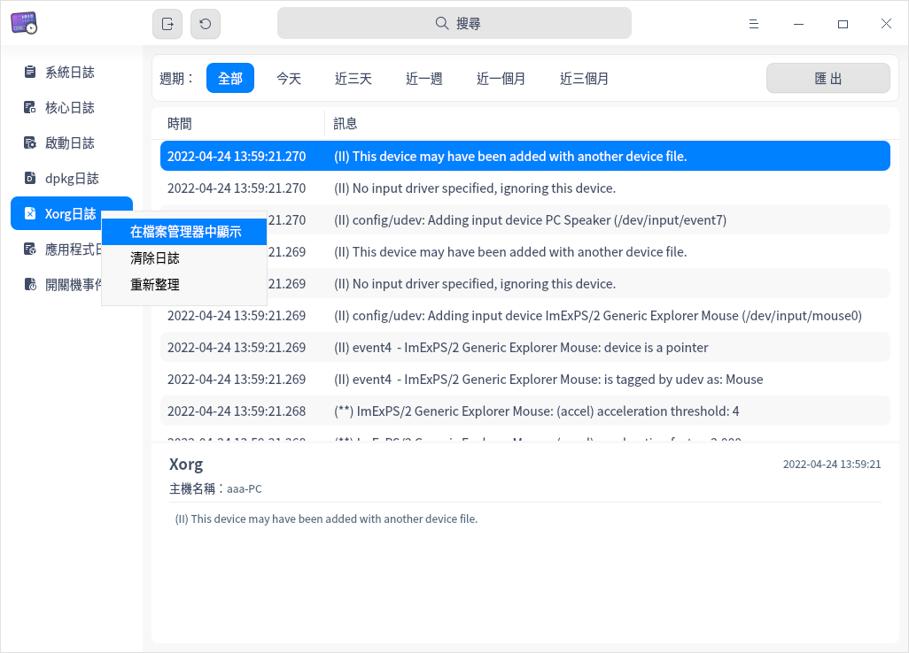

# 日誌收集工具|deepin-log-viewer|

## 概述

日誌收集工具是負責收集程式執行時所產生日誌的小工具，如作業系統和應用程式在啟動、執行等過程中的相關訊息。您可以透過分析詳細日誌訊息，快速的找到故障原因並解決問題。

## 使用入門

您可以透過以下方式執行或關閉日誌收集工具，或者建立捷徑。

### 執行日誌收集工具

1. 單擊任務欄上的  進入啟動器介面。
2. 上下滾動滑鼠滾輪瀏覽或透過搜尋找到 ，單擊執行日誌收集工具。
3. 右鍵單擊 ，您可以：
   - 單擊 **建立桌面捷徑**，在桌面建立捷徑。
   - 單擊 **釘選到Dock**，將應用程式固定到Dock。
   - 單擊 **開機啟動**，將應用程式添加到開機啟動項，在電腦開機時自動執行該應用程式。

### 關閉日誌收集工具

- 在日誌收集工具介面，單擊 ，關閉日誌收集工具。
- 右鍵單擊任務欄上的  圖示，選擇 **全部關閉** 來關閉日誌收集工具。
- 在日誌收集工具介面單擊 ，選擇 **離開** 來關閉日誌收集工具。

## 操作介紹

### 搜尋日誌

1. 在日誌收集工具搜尋框中，單擊 。
2. 輸入關鍵字，即時顯示搜尋結果。
3. 單擊  ，則清空搜尋內容。

### 篩選日誌

您可以透過 **週期**、**級別**、**狀態**、**應用列表** 或 **事件類型** 來篩選日誌。
<table border="1">
   <tr>
    <th>篩選類型</th>
 <th>說明 </th>
</tr>
   <tr>
    <td>按週期篩選</td>
    <td>按日誌生成的時間順序進行篩選。
      <ul>
          <li>選項包括：全部、今天、近三天、近一週、近一個月、近三個月，預設選項為全部。</li>
          <li>適用類型：除了啟動日誌沒有顯示時間外，其他類型的日誌都支援按週期篩選。</li>
      </ul>
 </td>
</tr>
   <tr>
    <td>按級別篩選</td>
    <td>按照事件的級別高低進行篩選。
    <ul>
          <li>選項包括：全部、緊急、嚴重警告、嚴重、錯誤、警告、注意、訊息、除錯，預設選項為訊息。</li>
          <li>適用類型：系統日誌、應用日誌。</li>
      </ul>
      <tr>
    <td>按狀態篩選</td>
    <td>
    <ul>
          <li>選項包括：全部、OK、Failed，預設選項為全部。</li>
          <li>適用類型：僅適用於啟動日誌。</li>
      </ul>
          <tr>
    <td>按應用列表篩選</td>
    <td>
        適用類型：僅適用於應用日誌，對應用程式的log文件進行篩選，預設選項為第一個應用程式。 </td>
              <tr>
    <td>按事件類型篩選</td>
    <td>
    <ul>
          <li>選項包括：全部、登入、開機、關機，預設選項為全部。</li>
          <li>適用類型：僅適用於開關機事件。</li>
      </ul>
 </td>
   </tr>
   </table>

### 查看日誌

#### 查看系統日誌

1. 在日誌收集工具介面，單擊 **系統日誌**。
2. 查看系統日誌的級別、行程、時間和訊息。
3. 選中某條日誌後，可查看該日誌的詳細訊息，包括行程、時間、主機名稱、行程號、級別和詳細訊息。

#### 查看核心日誌

1. 在日誌收集工具介面，單擊 **核心日誌**。
2. 在彈出的授權對話框中，輸入使用者密碼完成授權。
3. 查看核心日誌的時間、主機名稱、行程和訊息。
4. 選中某條日誌後，可查看該日誌的詳細訊息，包括行程、時間、主機名稱和詳細訊息。

#### 查看啟動日誌

1. 在日誌收集工具介面，單擊 **啟動日誌**。
2. 在彈出的授權對話框中，輸入使用者密碼完成授權。
3. 查看啟動日誌的狀態和訊息。
4. 選中某條日誌後，可查看該日誌的詳細訊息，包括行程、主機名稱、狀態和詳細訊息。

#### 查看dpkg日誌

1. 在日誌收集工具介面，單擊 **dpkg日誌**。
2. 查看dpkg日誌的時間和訊息。
3. 選中某條日誌後，可查看該日誌的詳細訊息，包括行程、時間、主機名稱、動作和詳細訊息。

#### 查看Xorg日誌

1. 在日誌收集工具介面，單擊 **Xorg日誌**。
2. 查看Xorg日誌的時間和訊息。
3. 選中某條日誌後，列表下方會顯示該日誌的詳細訊息，包括行程、時間、主機名稱和詳細訊息。

#### 查看應用程式日誌

1. 在日誌收集工具介面，單擊**應用程式日誌**。
2. 查看應用日誌的級別、時間、來源和訊息。
3. 選中某條日誌後，可查看該日誌的詳細訊息，包括時間 、主機名稱和詳細訊息。

#### 查看開關機事件

1. 在日誌收集工具介面，單擊 **開關機事件**。
2. 查看開關機事件的事件類型、使用者名稱、時間和訊息。
3. 選中某條日誌後，可查看該日誌的詳細訊息，包括時間、主機名稱、事件類型、使用者名稱和詳細訊息。

### 匯出

使用者可以將目前日誌匯出為文件進行儲存，支援匯出的檔案格式為txt/doc/xls/html。

1. 在日誌收集工具介面，單擊**匯出**。
2. 在彈出的視窗中選擇儲存路徑，設定檔案名稱和格式。
3. 單擊 **儲存**，成功匯出日誌後，介面下方會彈出提示訊息。

### 重新整理日誌

1. 在日誌收集工具左側導航欄中，右鍵單擊某一日誌類型。
2. 選擇 **重新整理**，重新載入該日誌檔案，更新日誌列表。

### 在檔案管理器中顯示

在日誌收集工具中僅核心日誌、啟動日誌、dpkg日誌、Xorg日誌和應用日誌支援 **在檔案管理器中顯示** 的功能。

1. 在日誌收集工具左側導航欄中，右鍵單擊某一日誌類型。
2. 選擇 **在檔案管理器中顯示**，定位到目前日誌的儲存位置。

### 清除日誌

在日誌收集工具中僅核心日誌、啟動日誌、dpkg日誌、Xorg日誌和應用日誌支援 **清除日誌** 的功能。
1. 在日誌收集工具左側導航欄中，右鍵單擊某一日誌類型。
2. 選擇 **清除日誌**。
3. 在彈出的對話框中單擊 **確定**。
4. 如果彈出密碼授權視窗，請輸入密碼完成操作。

## 主選單

在主選單中，您可以進行切換視窗主題，查看說明手冊等操作。

### 主題

視窗主題包含亮色主題、暗色主題和系統主題。

1. 在日誌收集工具介面，單擊 。
2. 單擊 **主題**，選擇一個主題顏色。

### 說明

查看說明手冊，進一步了解和使用日誌收集工具。

1. 在日誌收集工具介面，單擊 。
2. 單擊 **說明**。
3. 查看日誌收集工具的說明手冊。

### 關於

1. 在日誌收集工具介面，單擊 。
2. 單擊 **關於**。
3. 查看日誌收集工具的版本和介紹。

### 離開

1. 在日誌收集工具介面，單擊 。
2. 單擊 **離開**。

