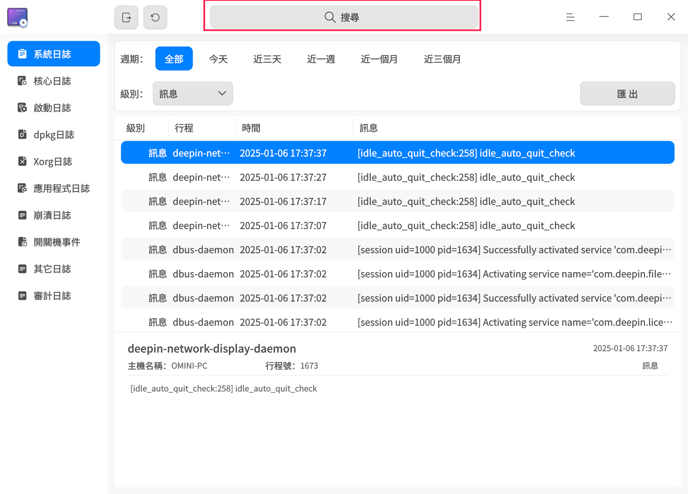
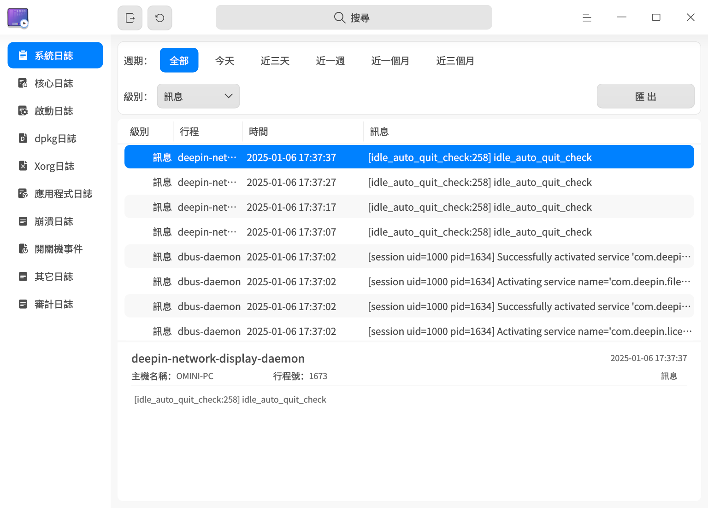
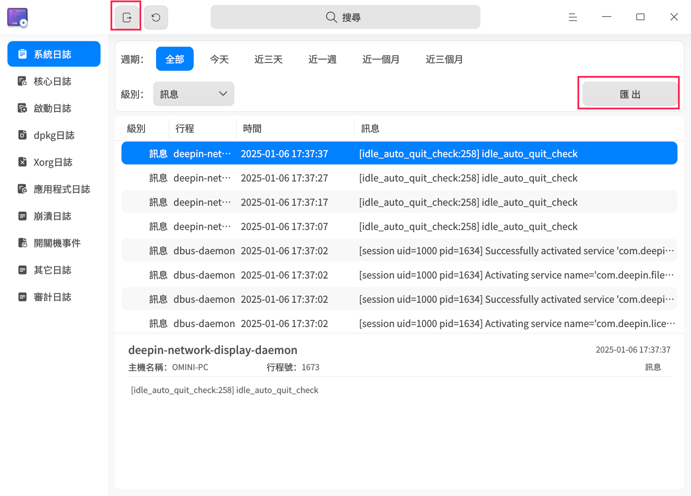
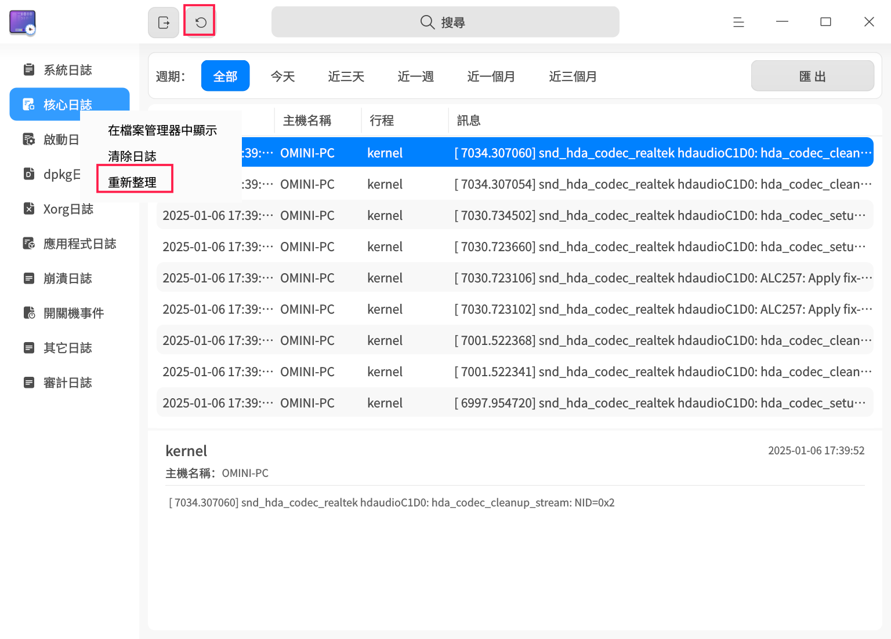
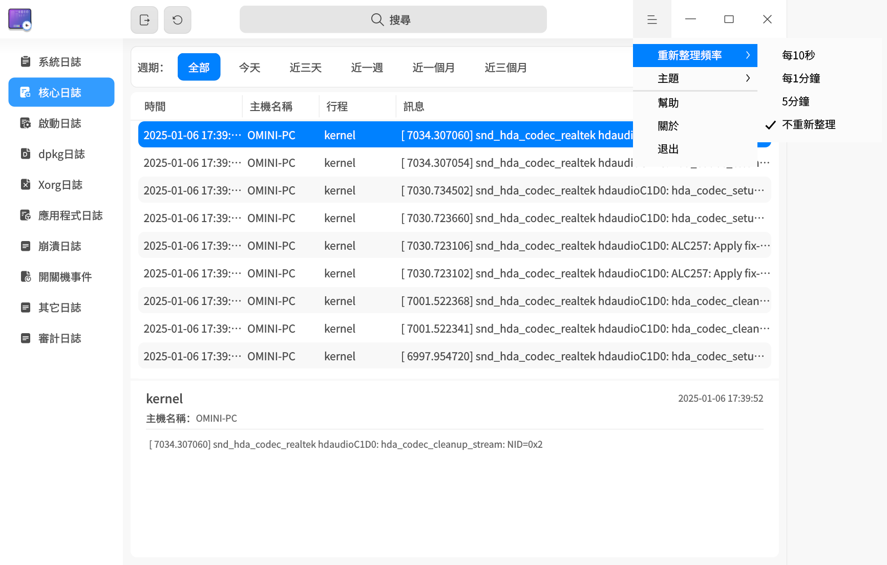
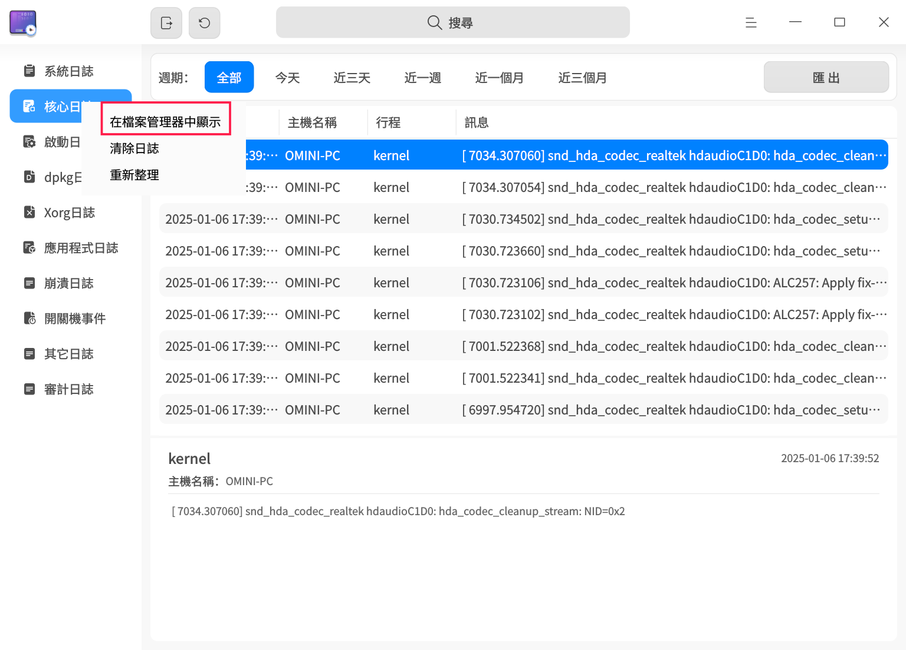
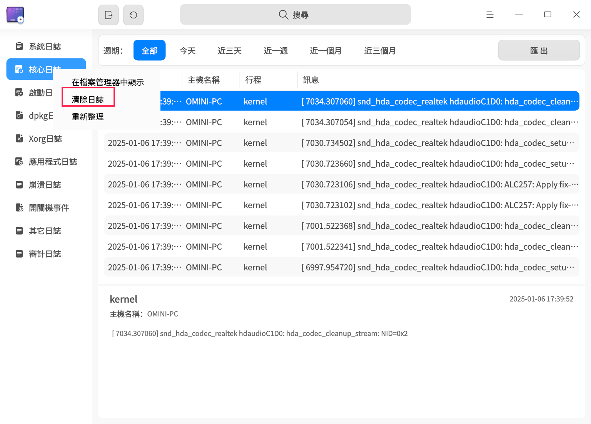

# 日誌收集工具|deepin-log-viewer|

## 概述

日誌收集工具是負責收集程式執行時所產生日誌的小工具，例如作業系統和應用程式在啟動、執行等操作過程中的相關資訊。您可以透過分析詳細的日誌資訊，快速找到故障原因並解決問題。

## 使用入門

您可以透過以下方式啟動、退出日誌收集工具，或建立捷徑。

### 啟動日誌收集工具

1. 單擊工具列上的啟動器圖示 ，進入啟動器介面。
2. 上下滾動滑鼠滾輪瀏覽或透過搜尋功能，找到日誌收集工具圖示，單擊啟動。
3. 右鍵單擊圖示 ，您可以執行以下操作：
   - 單擊 **發送到桌面**，在桌面建立捷徑。
   - 單擊 **發送到工具列**，將應用程式固定到工具列。
   - 單擊 **開機自動啟動**，將應用程式添加到開機啟動項，在電腦開機時自動啟動該應用程式。

### 退出日誌收集工具

- 在日誌收集工具主介面，單擊 ，退出日誌收集工具。
- 在工具列上右鍵單擊圖示 ，選擇 **關閉所有**，退出日誌收集工具。
- 在日誌收集工具主介面單擊 ，選擇 **退出**，退出日誌收集工具。

## 操作介紹

>  日誌收集工具支援多種日誌類型的展示。由於系統版本或架構的不同，可查看的日誌類型可能有所差異，具體功能請以最終頁面顯示內容為準。
>
>  由於日誌類型的不同，提供的篩選項、是否能在檔案管理器中顯示及是否支援清除日誌的功能也有所區別，具體功能請參照最終頁面的顯示內容。
>
> 下文將以系統日誌和核心日誌為例，介紹日誌收集工具的操作方式。

### 搜尋日誌

1. 在日誌收集工具搜尋框中，單擊 。
2. 輸入關鍵字，即時顯示搜尋結果。
3. 單擊 ，清空搜尋框中的搜尋內容。
   

### 篩選日誌

1. 在日誌收集工具頂部篩選欄中，選擇需要篩選的選項。
2. 單擊或選擇篩選項後，日誌收集工具將立即展示篩選結果。
   

### 查看日誌

1. 在日誌收集工具主介面，單擊需要查看的日誌類型選單，工具右側列表會展示目前日誌類型下所有的日誌條目。
2. 滑鼠左鍵單擊某條日誌後，可在工具下方查看該日誌的詳細資訊。
   

### 自訂日誌

自訂日誌功能允許您將日誌檔案添加到日誌收集工具中進行查看和匯出。自訂日誌支援 Gsettings 配置和 Dconfig 配置。
**Gsettings 配置**

1. 在終端執行 Gsettings 配置設定指令，在方括號內填寫日誌檔案路徑，例如：`['a.log','b.log','c.log']`。

   ```shell
   gsettings set com.deepin.log.viewer customlogfiles []
   ```

2. 在日誌收集工具主介面，單擊 **自訂日誌**，即可查看已配置的日誌檔案。

**Dconfig 配置**

1. 在終端執行 Dconfig 配置設定指令，在方括號內填寫日誌檔案路徑，例如：`["a.log","b.log","c.log"]`。

   ```shell
   dde-dconfig --set -a org.deepin.log.viewer -r org.deepin.log.viewer -k customLogFiles -v '["a.log","b.log","c.log"]'
   ```

2. 在日誌收集工具主介面，單擊 **自訂日誌**，即可查看已配置的日誌檔案。

### 匯出日誌

匯出日誌功能是將日誌查詢結果匯出到本機，幫助您分析、定位和解決問題。

1. 選擇某一日誌類型，單擊介面右上角 **匯出** 按鈕。
2. 如果出現密碼認證視窗，輸入使用者登入密碼後單擊 **確定**。
3. 在彈出的視窗中，選擇儲存位置，單擊 **儲存**。

>  說明：您也可以單擊標題欄上的全部匯出按鈕 ，將全量的日誌匯出。



### 重新整理日誌

重新整理日誌分為手動重新整理和自動重新整理，自動重新整理日誌的頻率可以自訂設定。

#### 手動重新整理日誌

單擊標題欄上的立即重新整理按鈕 ；或右鍵單擊某一日誌類型，選擇 **重新整理**，手動重新整理日誌內容。


#### 自動重新整理日誌

1. 在日誌收集工具主介面，單擊  > **重新整理頻率**。
2. 選擇自動重新整理的頻率：**每10秒**、**每1分鐘** 或 **每5分鐘**，日誌收集工具將按此頻率自動重新整理。選擇 **不重新整理** 即停止自動重新整理功能。
   

### 在檔案管理器中顯示

通過 **在檔案管理器中顯示** 功能，您可以查看部分日誌的原始日誌檔案。

1. 在日誌收集工具左側導航欄中，右鍵單擊某一日誌類型。
2. 選擇 **在檔案管理器中顯示**，系統將定位到目前日誌的儲存位置。
   

### 清除日誌

1. 在日誌收集工具左側導航欄中，右鍵單擊某一日誌類型。
2. 選擇 **清除日誌**。
3. 彈出"確定清除日誌？"提示框，單擊 **確定**。
4. 如果出現密碼認證視窗，輸入使用者登入密碼後單擊 **確定**。
   

## 主選單

在主選單中，您可以 [設定重新整理頻率](#自動重新整理日誌)、切換視窗主題、查看說明手冊等。

### 主題

視窗主題包含淺色主題、深色主題和系統主題。

1. 在日誌收集工具主介面，單擊 。
2. 選擇 **主題**，選擇一種主題顏色。

### 幫助

查看說明手冊，進一步了解和使用日誌收集工具。

1. 在日誌收集工具主介面，單擊 。
2. 選擇 **幫助**。
3. 查看日誌收集工具的詳細幫助手冊。

### 關於

1. 在日誌收集工具主介面，單擊 。
2. 選擇 **關於**。
3. 查看日誌收集工具的版本資訊和功能介紹。

### 退出

1. 在日誌收集工具主介面，單擊 。
2. 選擇 **退出**。
