# deepin-log-viewer AT-SPI UI Map

## Application Overview
- **Application**: Log Viewer (deepin-log-viewer)
- **Purpose**: View and export system logs
- **Framework**: Qt6 / DTK6 with DMainWindow

## Component Tree (Mermaid)

```mermaid
graph TD
    main[LogCollectorMain / DMainWindow]
    titlebar[Titlebar]
    searchEdt[DSearchEdit - Search]
    refreshIntervalMenu[DMenu - Refresh Interval]
    exportAllBtn[DIconButton - Export All]
    refreshBtn[DIconButton - Refresh Now]

    hLayout[QHBoxLayout]
    logCatelogue[LogListView - Site bar]
    splitterVertical[QSplitter]
    filterContent[FilterContent]
    displayContent[DisplayContent]

    filterContent --> period[Period Buttons Group]
    filterContent --> filterLine[Filter Line]
    filterLine --> lvTxt[DLabel - Level]
    filterLine --> cbx_lv[LogCombox - Level]
    filterLine --> dnflvTxt[DLabel - DNF Level]
    filterLine --> cbx_dnf_lv[LogCombox - DNF Level]
    filterLine --> appTxt[DLabel - Application]
    filterLine --> cbx_app[LogCombox - Application]
    filterLine --> submoduleTxt[DLabel - Submodule]
    filterLine --> cbx_submodule[LogCombox - Submodule]
    filterLine --> statusTxt[DLabel - Status]
    filterLine --> cbx_status[LogCombox - Status]
    filterLine --> typeTxt[DLabel - Event Type]
    filterLine --> typeCbx[LogCombox - Event Type]
    filterLine --> auditTypeTxt[DLabel - Audit Type]
    filterLine --> auditTypeCbx[LogCombox - Audit Type]
    filterLine --> exportBtn[LogNormalButton - Export]

    displayContent --> splitter[DSplitter]
    splitter --> treeView[LogTreeView]
    splitter --> spinnerWgt[LogSpinnerWidget]
    splitter --> spinnerWgt_K[LogSpinnerWidget_K]
    splitter --> detailWgt[logDetailInfoWidget]
    detailWgt --> textBrowser[logDetailEdit]

    logCatelogue --> systemLog[System Log]
    logCatelogue --> kernelLog[Kernel Log]
    logCatelogue --> bootLog[Boot Log]
    logCatelogue --> dpkgLog[dpkg Log]
    logCatelogue --> kwinLog[Kwin Log]
    logCatelogue --> xorgLog[Xorg Log]
    logCatelogue --> appLog[Application Log]
    logCatelogue --> coredumpLog[Coredump Log]
    logCatelogue --> bootShutdownEvent[Boot-Shutdown Event]
    logCatelogue --> authLog[Auth Log]
    logCatelogue --> auditLog[Audit Log]
    logCatelogue --> otherLog[Other Log]
    logCatelogue --> customLog[Custom Log]

    period --> allBtn[LogPeriodButton - All]
    period --> todayBtn[LogPeriodButton - Today]
    period --> threeDayBtn[LogPeriodButton - 3 Days]
    period --> lastWeekBtn[LogPeriodButton - 1 Week]
    period --> lastMonthBtn[LogPeriodButton - 1 Month]
    period --> threeMonthBtn[LogPeriodButton - 3 Months]

    main --> mainWindow[centralWidget / DWidget]
    subgraph Export Dialog
        exportDlg[ExportProgressDlg / DDialog]
    end
```

## Key UI Controls

### 1. Main Window (LogCollectorMain)
- **Class**: `LogCollectorMain` (extends `DMainWindow`)
- **AT-SPI Registration**: Via `SET_FORM_ACCESSIBLE(LogCollectorMain, ...)` in `accessible.h`
- **Children**:
  - `DSearchEdit` (m_searchEdt)
  - `DIconButton` (m_exportAllBtn) - with accessibleName "Export All"
  - `DIconButton` (m_refreshBtn) - with accessibleName "Refresh Now"
  - `DMenu` - refresh interval menu
  - `LogListView` (m_logCatelogue) - with accessibleName "left_side_bar"
  - `FilterContent` (m_topRightWgt) - with accessibleName "filterWidget"
  - `DisplayContent` (m_midRightWgt) - with accessibleName from SET_FORM_ACCESSIBLE

### 2. Filter Content (FilterContent)
- **Class**: `FilterContent` (extends `DFrame`)
- **AT-SPI Registration**: Via `SET_FORM_ACCESSIBLE(FilterContent, ...)` in `accessible.h`
- **Children**:
  - LogPeriodButton instances for time period selection
  - LogCombox instances for filtering
  - DLabel instances for filter descriptions
  - LogNormalButton for export

### 3. Display Content (DisplayContent)
- **Class**: `DisplayContent` (extends `DWidget`)
- **AT-SPI Registration**: Via `SET_FORM_ACCESSIBLE(DisplayContent, ...)` in `accessible.h`
- **Children**:
  - `LogTreeView` (m_treeView) - with accessibleName "logTreeView"
  - `LogSpinnerWidget` (m_spinnerWgt) - with accessibleName "spinnerWidget"
  - `LogSpinnerWidget` (m_spinnerWgt_K) - with accessibleName "spinnerWidget_K"
  - `logDetailInfoWidget` (m_detailWgt) - with accessibleName "detailInfoWidget"
  - `exportProgressDlg` (m_exportDlg) - with accessibleName "ExportProgressDlg"
  - `DLabel` (noResultLabel) - with accessibleName "noResultLabel"
  - `DLabel` (notAuditLabel) - with accessibleName "notAuditLabel"
  - `DLabel` (noCoredumpctlLabel) - with accessibleName "noCoredumpctlLabel"
  - `DLabel` (noPermissionLabel) - with accessibleName "noPermissionLabel"

### 4. Log List View (LogListView - Sidebar)
- **Class**: `LogListView` (extends `DListView`)
- **AT-SPI Registration**: Via `SET_FORM_ACCESSIBLE(LogListView, ...)` in `accessible.h`

### 5. Log Tree View (LogTreeView)
- **Class**: `LogTreeView` (extends `DTreeView`)
- **AT-SPI Registration**: Via `SET_FORM_ACCESSIBLE(LogTreeView, ...)` in `accessible.h`

### 6. Custom Button Types
- **LogPeriodButton**: `DPushButton` - AT-SPI via `SET_BUTTON_ACCESSIBLE`
- **LogNormalButton**: `DPushButton` - AT-SPI via `SET_BUTTON_ACCESSIBLE`
- **LogIconButton**: `QPushButton` - AT-SPI via `SET_BUTTON_ACCESSIBLE`
- **LogCombox**: `DComboBox` - AT-SPI via `SET_FORM_ACCESSIBLE`

### 7. Detail Widget
- **logDetailInfoWidget**: `DWidget` - AT-SPI via `SET_FORM_ACCESSIBLE(logDetailInfoWidget, ...)`
  - Contains labels for daemon name, user, PID, etc.
  - Contains `logDetailEdit` (DTextBrowser) for log message display

## File References
- `application/accessible.h` - AT-SPI factory and all SET_*_ACCESSIBLE macros
- `application/logcollectormain.cpp` - Main window setup
- `application/displaycontent.cpp` - Display content and detail area
- `application/filtercontent.cpp` - Filter controls
- `application/loglistview.cpp` - Log type sidebar
- `application/main.cpp` - Entry point with `QAccessible::installFactory`
